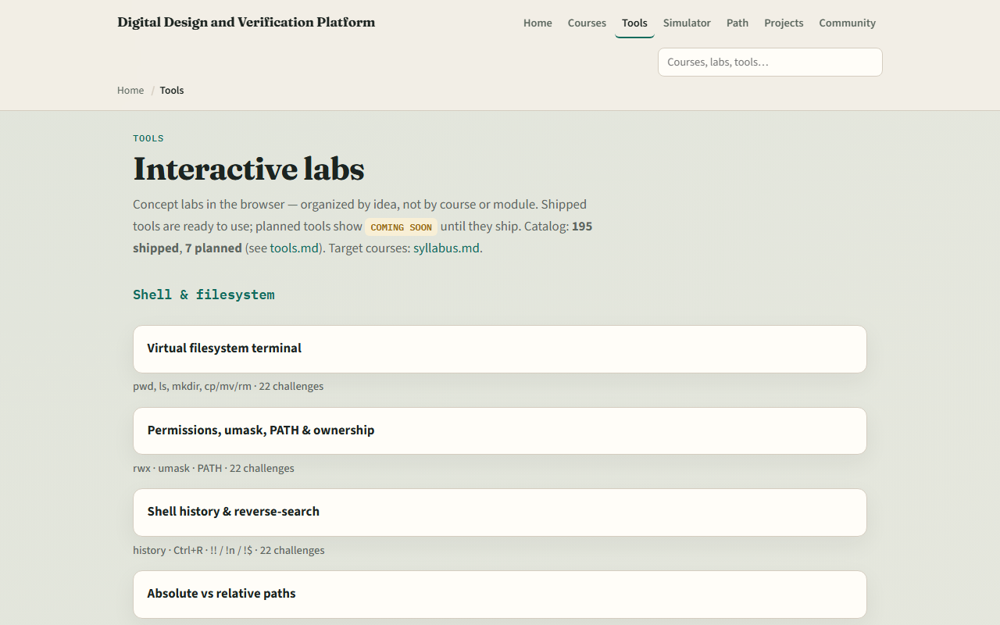

# Welcome to digital foundations

Digital chips speak in bits, gates, clocks, and state

---

## What you’ll build toward
- Across the course you’ll move from numbers and encodings
- You are not learning a hardware language yet
- Coding in Verilog and SystemVerilog comes later
- Here you learn the concepts those languages describe

---

## Two tracks, one idea
- Every lab module offers two ways to practice
- The workbook track is paper or notes
- The browser lab track uses interactive tools on the learning platform for quick feedback
- You may do either track, or both
- A good rhythm is browser first for the idea, then a paper sketch to harden it

---

## Set up the workbook track
- Grab a notebook or tablet
- That is the whole setup for the workbook track
- When a module asks you to sketch a table or a timing diagram, do it by hand
- Stretch reading in the older combined digital-and-Verilog materials is optional

---

## Set up the browser lab track
- From the monorepo
- That index is the map of interactive labs you’ll use later
- If you prefer, use the published tools site instead
- Confirm you can reach the tools page, the next module will send you into a specific lab

---

## How to move through modules
- For each module
- When you finish this intro checklist, continue to the first lab

