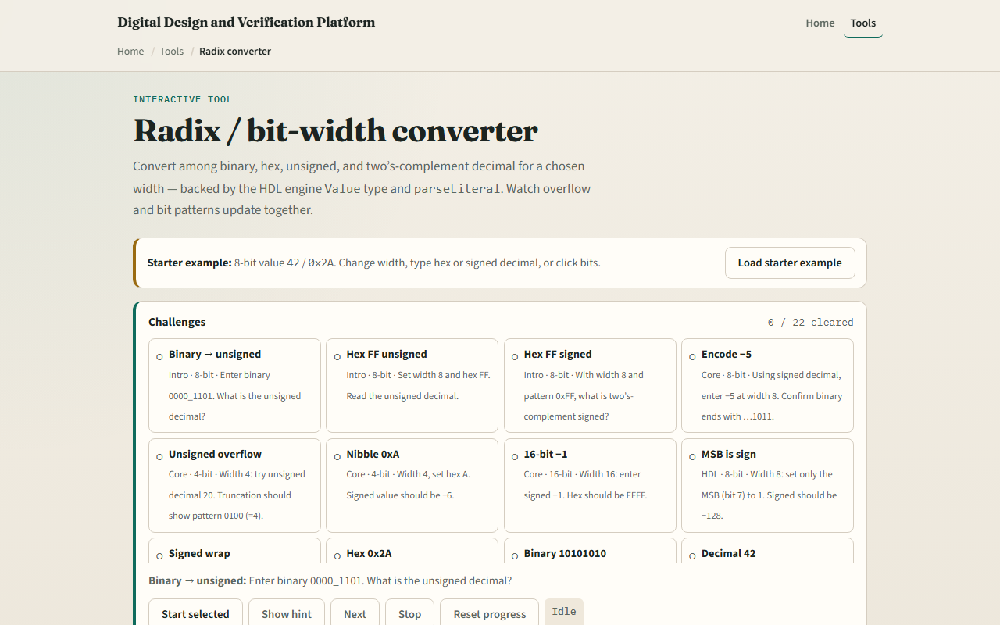

# Radix & bit width

Hardware does not store “thirteen.” It stores a fixed-width bit pattern that you may read as binary

---

## Same bits, many readings
- A width is a hard budget: eight bits is not the same box as four bits
- Inside one width, the pattern is shared
- Binary, hex, and unsigned decimal are different spellings of those bits
- Signed two’s complement is another reading of the same pattern
- Change the width, and the meaning can change even if you type the same digits

---

## Browser lab

---

## Workbook practice
- In the workbook track, pick one concrete conversion and do it by hand
- For example, take unsigned decimal thirteen at width eight
- Write the eight-bit binary, then the hex
- Then flip to signed thinking: what signed value is the all-ones pattern at that width?
- Write one pitfall you will watch for in later RTL

---

## Pitfalls to watch
- Do not treat hex digits as if the width were infinite
- Do not confuse “the number I typed” with “the bits the hardware keeps.” And remember
- When you write RTL later

---

## Your turn
- Complete the checklist for at least one track, preferably both
- In the browser, finish a few challenges after the starter
- On paper, finish at least one worked conversion and name one pitfall
- When you are ready, take the short quiz, then continue to two’s complement

