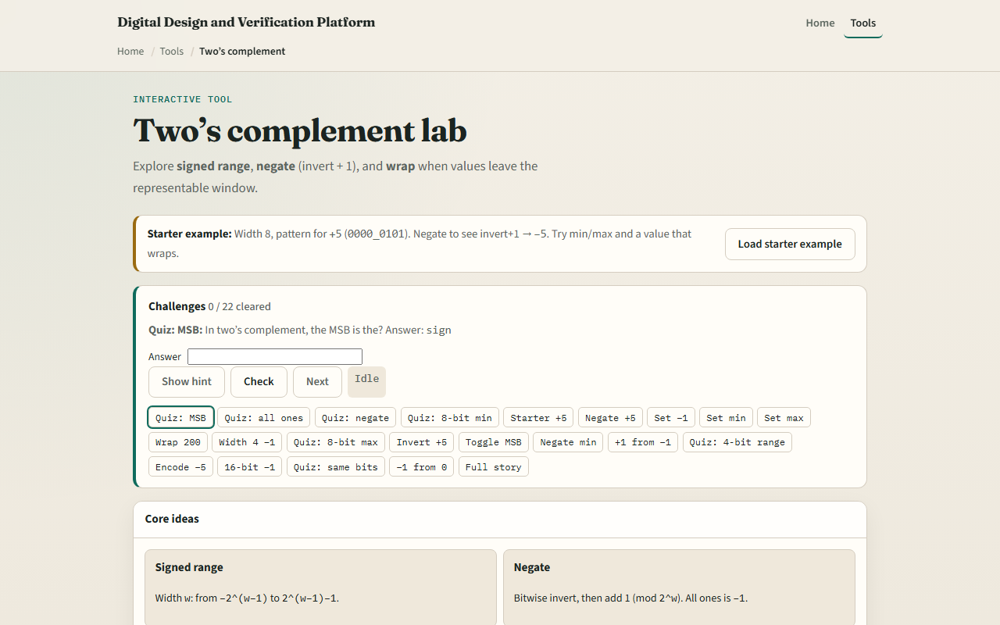

# Module 02 — Two’s complement

**Module id:** module02-twos-complement  
**Lab:** twos-complement  
**Tracks:** A (workbook) · B (browser lab)

## Slide 1 — Two’s complement

Unsigned numbers only go one way. Hardware also needs negative values in the same bit box. Two’s complement is the usual signed encoding: the most significant bit is the sign, and addition still works with ordinary binary adders. This module makes that encoding tangible—in the browser, then on paper.

## Slide 2 — Sign bit, negate, range

At a fixed width, the top bit is the sign. All ones is minus one. To negate, invert every bit and add one. The range is not symmetric: at width eight you get minus one hundred twenty-eight through plus one hundred twenty-seven. That asymmetric floor is easy to forget when you “just add one more.”

## Slide 3 — Browser lab

In the browser lab, look at three pieces: the challenge panel, the bit pattern, and the signed value controls. Load the starter—you should see plus five—then try Negate and watch the bits become minus five. Use Check when a challenge looks done. Explore a few challenges; you do not need a full UI tour here.

## Slide 4 — Workbook practice

In the workbook track, write width eight on paper. Start from plus five: bits ending in zero one zero one. Negate by hand—invert, then add one—and confirm you land on minus five. Then write the signed meanings of all ones, the minimum pattern with only the sign bit set, and the maximum with the sign clear and the rest ones. Name one RTL pitfall: treating a signed wire as unsigned, or forgetting the asymmetric min.

## Slide 5 — Pitfalls to watch

Do not read the most significant bit as “just another magnitude bit” when the type is signed. Do not expect plus one hundred twenty-eight to fit in eight-bit two’s complement—it wraps. And remember: the browser lab is literacy. Waveforms and RTL still demand the same signed-versus-unsigned discipline.

## Slide 6 — Your turn

Complete the checklist for at least one track—preferably both. In the browser, finish a few challenges after the starter. On paper, negate one value by hand and list min, max, and minus one for one width. When you are ready, take the short quiz, then continue to overflow and wrap.
