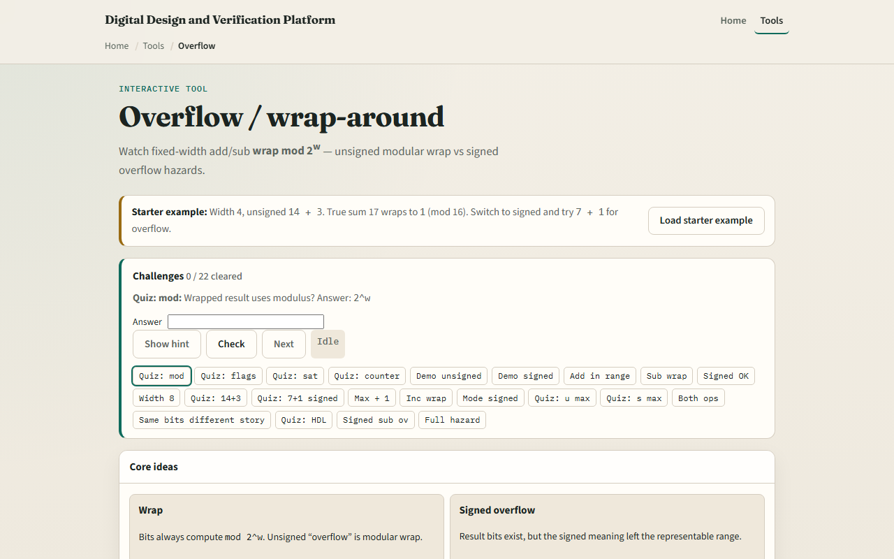

# Overflow / wrap

Fixed-width math does not grow a bigger box when the answer is too big

---

## Wrap versus signed overflow
- Unsigned wrap is modular arithmetic: results live modulo two to the width
- Add fourteen and three in four bits and you store one, not seventeen
- Signed overflow is different
- Carry and signed overflow are not the same question

---

## Browser lab

---

## Workbook practice
- In the workbook track, pick width four
- On paper, add fourteen plus three unsigned and show why the stored result is one
- Treating carry as if it meant signed overflow

---

## Pitfalls to watch
- Do not assume saturation, clamping to min or max, is the same as wrap
- Do not ignore width when you “check the answer in your head” with unlimited decimal
- And remember: the browser lab is literacy
- Waveforms still show the wrapped bits, not the mathematical ideal

---

## Your turn
- Complete the checklist for at least one track, preferably both
- In the browser, finish a few challenges after the starter
- On paper, work one unsigned wrap and one signed overflow example
- When you are ready, take the short quiz, then continue to ASCII and hex dump literacy

