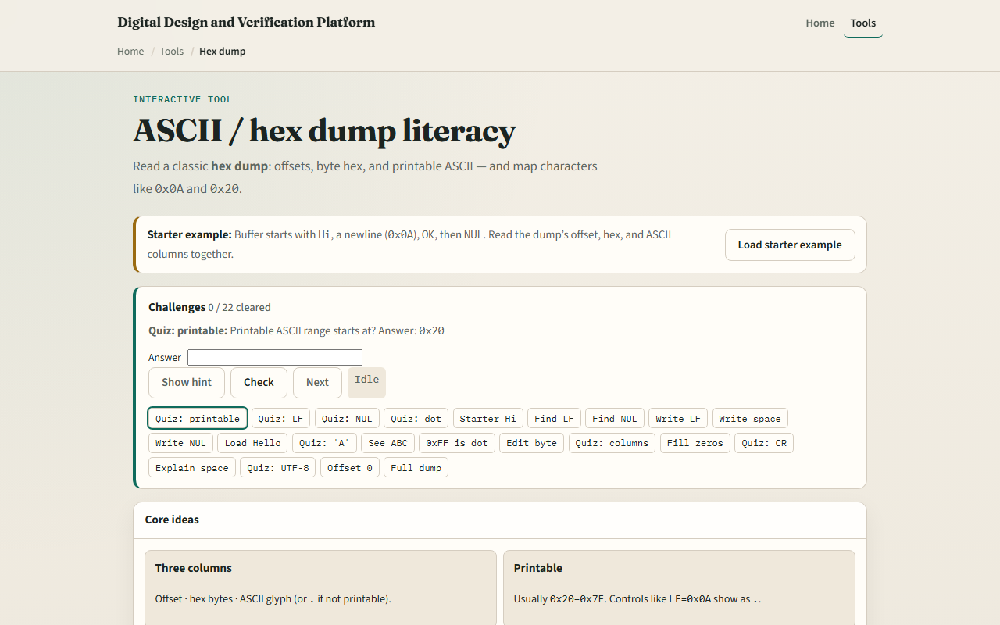

# Module 04 — ASCII / hex dump

**Module id:** module04-ascii-hex  
**Lab:** ascii-hex  
**Tracks:** A (workbook) · B (browser lab)

## Slide 1 — ASCII / hex dump

Logs, ROMs, and memory dumps are often rows of hex with a printable side view. ASCII is just a mapping from byte values to characters—and many bytes are not printable. This module builds dump literacy: read a byte as hex, know common controls, and see why non-printables show as dots.

## Slide 2 — Bytes, glyphs, and controls

Printable ASCII typically starts at hex twenty—the space—and runs through the usual letters and digits. Newline is line feed, hex zero A. A C-style string ends with NUL, hex zero zero. When a dump cannot show a glyph, it prints a dot so the columns still line up. Hex on the left and glyphs on the right are two views of the same bytes.

## Slide 3 — Browser lab

In the browser lab, look at three pieces: the challenge panel, the hex/ASCII dump view, and the explain or write controls. Load the starter—you should see “Hi,” a newline, “OK,” then a NUL, with more text later in the buffer. Select a byte and Explain, or write a control. Use Check when a challenge looks done. Explore a few; no full tour needed.

## Slide 4 — Workbook practice

In the workbook track, write a tiny dump by hand. Encode the letters H and i, then a line feed, then O and K, then NUL. Mark which offsets are printable and which would show as dots. Name one RTL or bring-up pitfall: treating a binary buffer as text, or forgetting that NUL ends a C string even when more bytes follow.

## Slide 5 — Pitfalls to watch

Do not assume every byte is a letter—controls and high bytes break that story. Do not confuse hex “zero A” with the digit characters for one and zero. And remember: the browser lab is literacy. Real dumps from simulators and flash still use the same byte-to-glyph rules.

## Slide 6 — Your turn

Complete the checklist for at least one track—preferably both. In the browser, finish a few challenges after the starter. On paper, dump a short string with one control and one NUL. When you are ready, take the short quiz, then continue to Gray code.
