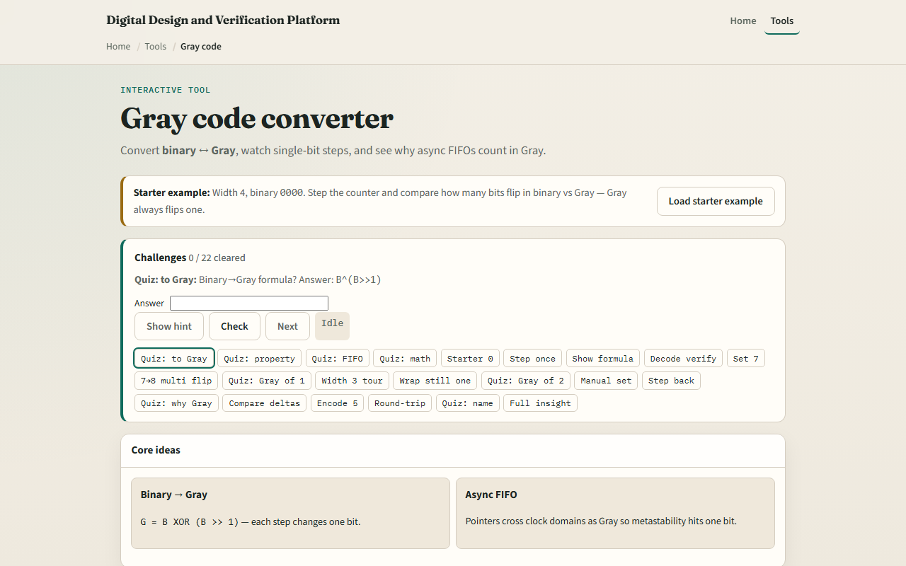

# Module 05 — Gray code

**Module id:** module05-gray-code  
**Lab:** gray-code  
**Tracks:** A (workbook) · B (browser lab)

## Slide 1 — Gray code

Binary counts flip many bits at once—seven to eight is a noisy edge. Gray code changes only one bit between neighbors. That property shows up in rotary encoders and in async FIFO pointer handoff across clocks. This module makes binary-to-Gray conversion concrete.

## Slide 2 — One-bit neighbors, convert carefully

To encode binary to Gray, exclusive-or the value with itself shifted right by one. Adjacent Gray codes differ by exactly one bit. Do not do ordinary add or compare on Gray bits as if they were binary—decode first when you need arithmetic. Async FIFOs prefer Gray pointers so only one bit is in flight across a synchronizer.

## Slide 3 — Browser lab

In the browser lab, look at three pieces: the challenge panel, the binary and Gray bit views, and Step or convert controls. Load the starter at width four and binary zero, then Step once and watch a single bit flip in Gray. Show the convert formula when you want the exclusive-or picture. Use Check when a challenge looks done. Explore a few; no full tour needed.

## Slide 4 — Workbook practice

In the workbook track, take width four. Write binary zero through a few counts and the Gray code beside each. Confirm each step flips one Gray bit. Encode binary seven by hand with exclusive-or of the value and its right shift, and check you get zero one zero zero. Note one pitfall: adding in Gray without decoding.

## Slide 5 — Pitfalls to watch

Do not treat Gray as “just another binary.” Multi-bit binary transitions are exactly what Gray avoids. And remember: the browser lab is literacy. Real CDC and FIFO designs still depend on that single-bit property across clock domains.

## Slide 6 — Your turn

Complete the checklist for at least one track—preferably both. In the browser, finish a few challenges after the starter. On paper, build a short Gray table and one encode by hand. When you are ready, take the short quiz, then continue to BCD.
