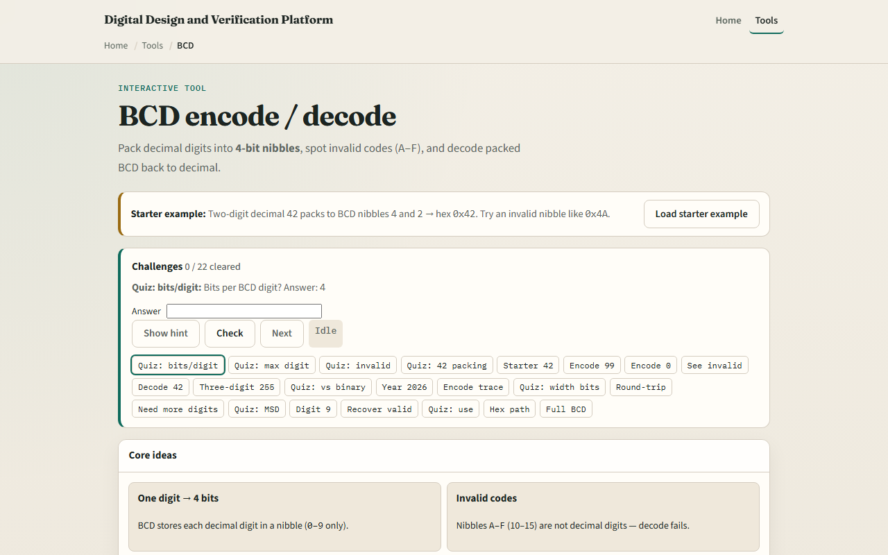

# BCD

Binary-coded decimal stores each decimal digit in its own four-bit nibble

---

## Four bits per digit
- Each BCD digit uses four bits and runs from zero through nine
- Nibbles A through F are invalid
- Packed BCD lays digits side by side in one word
- Do not confuse BCD with ordinary binary of the same decimal value

---

## Browser lab

---

## Workbook practice
- In the workbook track, write packed BCD for forty-two, ninety-nine
- Mark why nibble A is illegal
- Encode two thousand twenty-six as four digits and check you get hex two-zero-two-six
- Note one pitfall: treating binary zero-x-two-A as if it were BCD for forty-two

---

## Pitfalls to watch
- Do not mix binary and BCD encodings of the same number
- Invalid nibbles must be rejected, not silently accepted
- And remember: the browser lab is literacy
- Real displays and decimal datapaths still need correct packing width and digit checks

---

## Your turn
- Complete the checklist for at least one track, preferably both
- In the browser, finish a few challenges after the starter
- On paper, pack a few decimals and one invalid case by hand
- When you are ready, take the short quiz, then continue to parity and checksum

