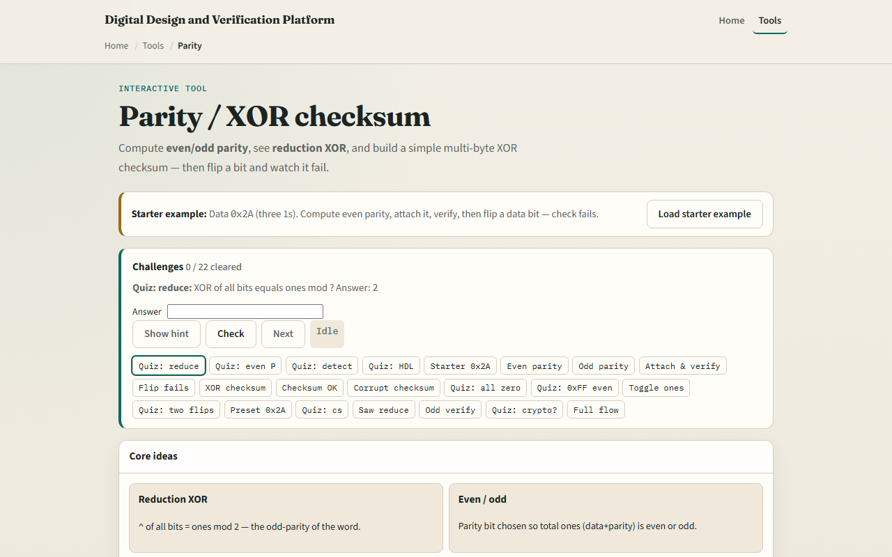

# Module 07 — Parity / checksum

**Module id:** module07-parity-checksum  
**Lab:** parity-checksum  
**Tracks:** A (workbook) · B (browser lab)

## Slide 1 — Parity and checksum

Links drop bits. Parity adds one check bit so even or odd ones count stays consistent. A simple XOR checksum folds bytes into one check value. Neither fixes errors—they detect many single flips. This module makes compute, attach, and verify concrete.

## Slide 2 — Detect, do not correct

Even parity sets the check bit so the total ones count is even—often just the reduction XOR of the data bits. Odd parity flips that sense. XOR of all bits is ones-count mod two. Parity does not correct bit errors. A multi-byte XOR checksum verifies when the fold comes back zero; corruption breaks the check.

## Slide 3 — Browser lab

In the browser lab, look at three pieces: the challenge panel, the data and parity or checksum views, and Compute, Attach, Verify, or Flip controls. Load the starter at hex two-A with even parity. Compute, attach, and verify for a PASS, then flip a data bit and watch FAIL. Try the XOR checksum path on the starter bytes when you want a multi-byte check. Use Check when a challenge looks done.

## Slide 4 — Workbook practice

In the workbook track, take data hex two-A. Count the ones, compute even and odd parity bits by hand, and say which verify fails after flipping bit zero. Sketch a three-byte XOR checksum and note that a corrupt byte fails the zero fold. Name one pitfall: assuming parity repairs the bad bit.

## Slide 5 — Pitfalls to watch

Do not treat parity as error correction. Even and odd modes disagree if you mix them across sender and receiver. And remember: the browser lab is literacy. Real links still need framing, stronger codes, or retries when one bit of protection is not enough.

## Slide 6 — Your turn

Complete the checklist for at least one track—preferably both. In the browser, finish a few challenges after the starter. On paper, compute one parity bit and one XOR checksum by hand. When you are ready, take the short quiz, then continue to fixed-point.
