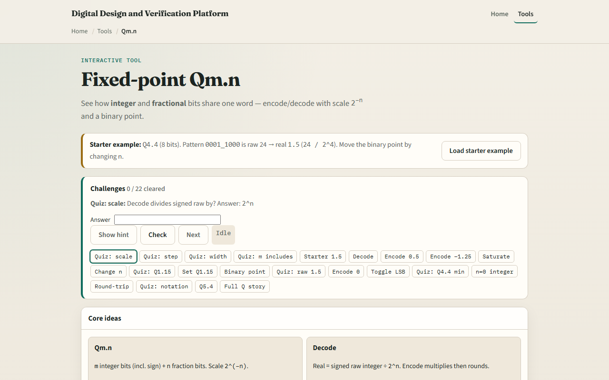

# Fixed-point Qm.n

Hardware often needs fractions without a full floating-point unit

---

## Scale, step, and width
- In this lab, total width W equals m plus n
- The smallest positive step is two to the minus n
- Encoding a real multiplies by two to the n and rounds into the bit field
- Changing n with the same raw bits moves the binary point and changes the real value
- M includes the sign bit here

---

## Browser lab

---

## Workbook practice
- In the workbook track, take Q four-dot-four
- Show why raw twenty-four is one-point-five, and why raw eight is zero-point-five
- Compute the step size as one sixteenth
- Note the approximate min near minus eight
- Name one pitfall: treating raw bits as a float without dividing by two to the n

---

## Pitfalls to watch
- Do not forget the scale when you mix formats
- Saturation is not the same as wrap
- And remember: the browser lab is literacy
- Real DSP still needs agreed Q formats, rounding modes, and overflow policy across blocks

---

## Your turn
- Complete the checklist for at least one track, preferably both
- In the browser, finish a few challenges after the starter
- On paper, encode and decode one Q four-dot-four value by hand
- When you are ready, take the short quiz, then continue to bit-fields

