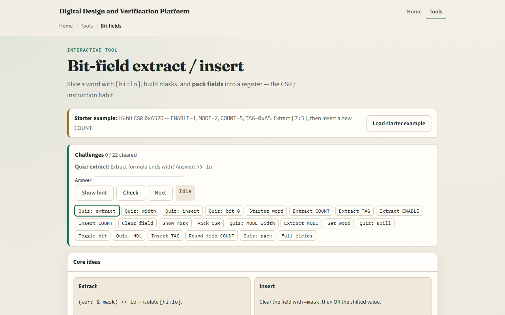

# Module 09 — Bit-fields

**Module id:** module09-bit-fields  
**Lab:** bit-fields  
**Tracks:** A (workbook) · B (browser lab)

## Slide 1 — Bit-fields

Control and status registers pack flags and counters into one word. A field lives between hi and lo inclusive. Extract shifts right by lo after masking; insert clears the slice with not-mask, then ORs the new value. This module makes CSR pack and unpack concrete.

## Slide 2 — Extract, insert, mask

Field width is hi minus lo plus one. Bit zero is the LSB in this lab. Before you OR an insert, clear the old field with the inverted mask so neighboring bits stay put. An unmasked insert value can spill into other fields. Show the mask formula when you want the bit picture.

## Slide 3 — Browser lab

In the browser lab, look at three pieces: the challenge panel, the word bit view with named fields, and Extract, Insert, or Pack controls. Load the starter word hex A-five-two-D. Extract COUNT in bits seven through three—you should get five. Try TAG and ENABLE, then insert a new COUNT. Pack a full CSR when you want the assemble path. Use Check when a challenge looks done.

## Slide 4 — Workbook practice

In the workbook track, take word A-five-two-D. Extract COUNT at seven to three by hand and confirm five. Clear that field with insert zero and check TAG is unchanged. Write width of MODE at two to one as two. Name one pitfall: inserting without masking so bits spill.

## Slide 5 — Pitfalls to watch

Do not assume bit zero is MSB—this lab uses LSB numbering. Overlapping fields or wrong hi and lo break packs. And remember: the browser lab is literacy. Real CSRs still need a spec for reset values, access types, and side effects.

## Slide 6 — Your turn

Complete the checklist for at least one track—preferably both. In the browser, finish a few challenges after the starter. On paper, extract and insert one field by hand. When you are ready, take the short quiz, then continue to endian packing.
