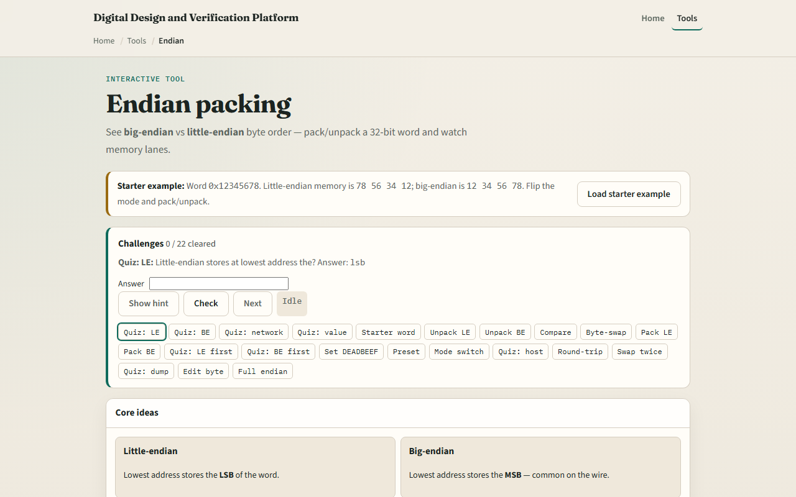

# Module 10 — Endian packing

**Module id:** module10-endian-lab  
**Lab:** endian-lab  
**Tracks:** A (workbook) · B (browser lab)

## Slide 1 — Endian packing

The same integer can sit in memory two ways. Little-endian puts the LSB at the lowest address; big-endian puts the MSB there. Network byte order is usually big-endian. Endianness does not change the integer value—it changes how bytes are laid out in RAM. This module makes pack and unpack concrete.

## Slide 2 — Unpack, pack, swap

Unpack splits a word into bytes in address order for the chosen mode. Pack builds the word from bytes at plus zero through plus three. Byte-swap reverses the four bytes in the word. Compare LE versus BE when you want the side-by-side picture. For hex one-two-three-four-five-six-seven-eight, LE bytes at plus zero are seven-eight five-six three-four one-two; BE puts one-two first.

## Slide 3 — Browser lab

In the browser lab, look at three pieces: the challenge panel, the word and byte-at-address views, and Unpack, Pack, or Swap controls. Load the starter word hex one-two-three-four-five-six-seven-eight. Unpack in little-endian and confirm bytes seven-eight five-six three-four one-two. Switch to big-endian and compare layouts. Try pack from memory bytes or byte-swap to hex seven-eight-five-six-three-four-one-two. Use Check when a challenge looks done.

## Slide 4 — Workbook practice

In the workbook track, take word one-two-three-four-five-six-seven-eight. Write LE and BE byte order at addresses plus zero through plus three. Pack LE bytes A-A B-B C-C D-D and check you get D-D C-C B-B A-A. Note one pitfall: assuming host endian always matches the wire or the spec.

## Slide 5 — Pitfalls to watch

Do not confuse byte order with bit order inside a byte. Mixing LE and BE across a bus without conversion corrupts multi-byte fields. And remember: the browser lab is literacy. Real SoCs still need explicit endian policy on DMA, registers, and network frames.

## Slide 6 — Your turn

Complete the checklist for at least one track—preferably both. In the browser, finish a few challenges after the starter. On paper, unpack one word both ways and pack one byte sequence. When you are ready, take the short quiz, then continue to truth tables.
