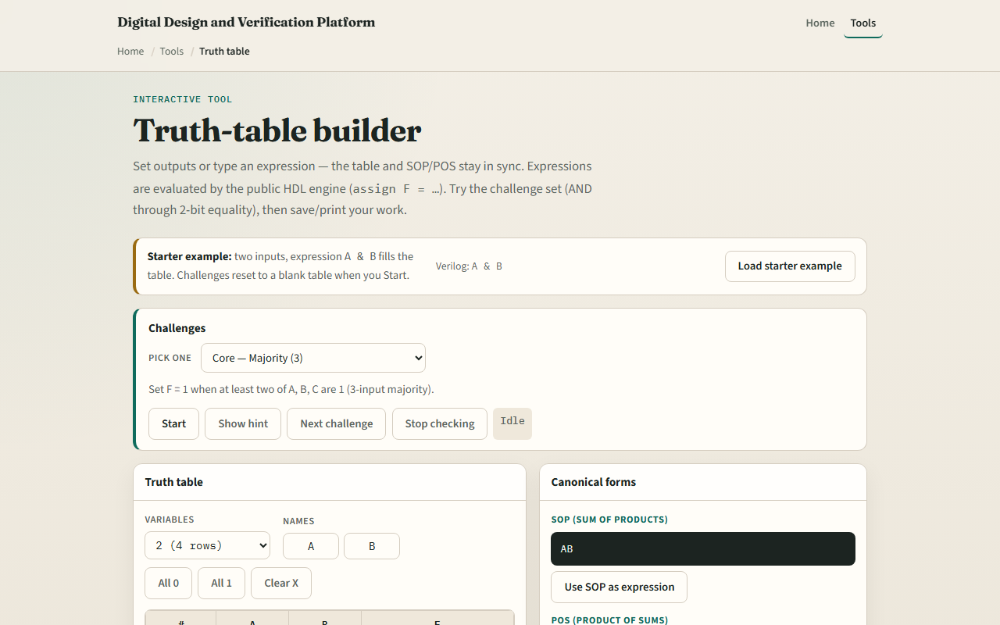

# Truth tables

A truth table lists every input combination and the output F

---

## Every row, one function
- Each row is one minterm index from all zeros through all ones
- AND is one only when every input is one
- OR is one when any input is one
- XOR is one when inputs differ
- Challenges in the lab ask you to match a described function
- Edit F in the table or the expression; both can stay in sync

---

## Browser lab

---

## Workbook practice
- In the workbook track, build a two-input AND and XOR table by hand
- Add a three-input majority row set
- Say how many rows you need for four variables
- Name one pitfall

---

## Pitfalls to watch
- Do not skip rows or duplicate an index
- X in a cell means don’t-care, not “pick any answer.” And remember
- Real verification still needs exhaustive or constrained cases beyond one hand table

---

## Your turn
- Complete the checklist for at least one track, preferably both
- In the browser, finish a few challenges after the starter
- On paper, write one full table and circle the minterms where F is one
- When you are ready, take the short quiz, then continue to Boolean laws

