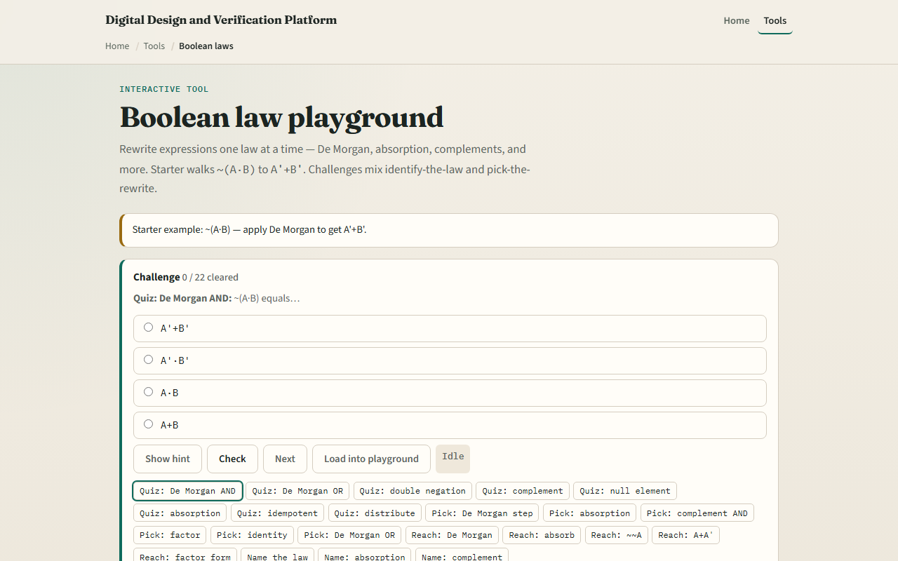

# Boolean laws

Algebra lets you simplify logic before you draw gates

---

## Rewrite with a reason
- Each click should name the law: not of A and B becomes not-A or not-B
- A plus A-and-B collapses to A
- A and not-A is zero
- Double negation peels to A
- Factor A-and-B plus A-and-C into A-and the sum of B and C
- The history list shows your proof chain; Undo when a step goes wrong

---

## Browser lab

---

## Workbook practice
- In the workbook track, simplify not of A or B by De Morgan
- Collapse A plus A-and-B to A
- Show A-and-not-A is zero and A-or-not-A is one
- Factor A-B plus A-C by hand
- Name one pitfall: distributing a NOT only over part of a term

---

## Pitfalls to watch
- Do not treat AND and OR as ordinary arithmetic, De Morgan flips both operator and negation
- Skipping steps can hide an illegal rewrite
- And remember: the browser lab is literacy
- Real synthesis still needs consistent don't-care and timing context

---

## Your turn
- Complete the checklist for at least one track, preferably both
- In the browser, finish a few challenges after the starter
- On paper, do two rewrites with the law named beside each step
- When you are ready, take the short quiz, then continue to K-maps

