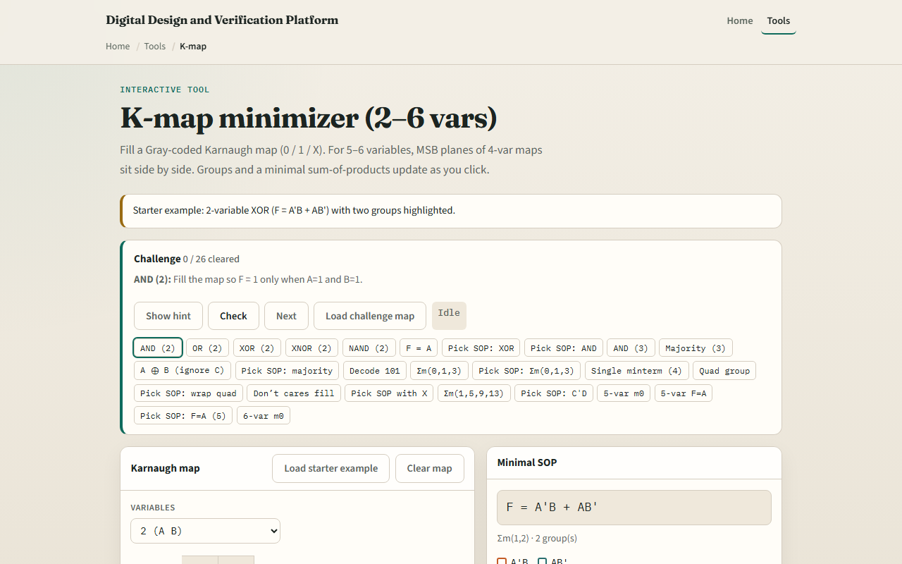

# K-maps

A Karnaugh map lays truth-table ones on a grid so adjacent cells differ by one bit

---

## Adjacent ones, bigger groups
- Two-variable maps use Gray order on both axes
- Three and four variables add more cells but the same rule: circle the largest legal groups
- A group of four drops two literals
- Don’t-care X cells can join a group when they help
- Pick the minimal SOP when the challenge asks, one term per group

---

## Browser lab

---

## Workbook practice
- In the workbook track, sketch a two-input XOR map by hand and write its SOP
- On three variables, group ones for at least two of A, B, or C
- Mark why top and bottom rows are neighbors on a four-var map
- Name one pitfall: grouping only in a straight line and missing a wrap-around quad

---

## Pitfalls to watch
- Do not treat diagonal cells as adjacent, they are not
- A group must be a power-of-two size
- And remember: the browser lab is literacy
- Real logic minimization still needs consistent variable order and don’t-care specs from

---

## Your turn
- Complete the checklist for at least one track, preferably both
- In the browser, finish a few challenges after the starter
- On paper, draw one map and circle the groups
- When you are ready, take the short quiz, then continue to SOP and POS

