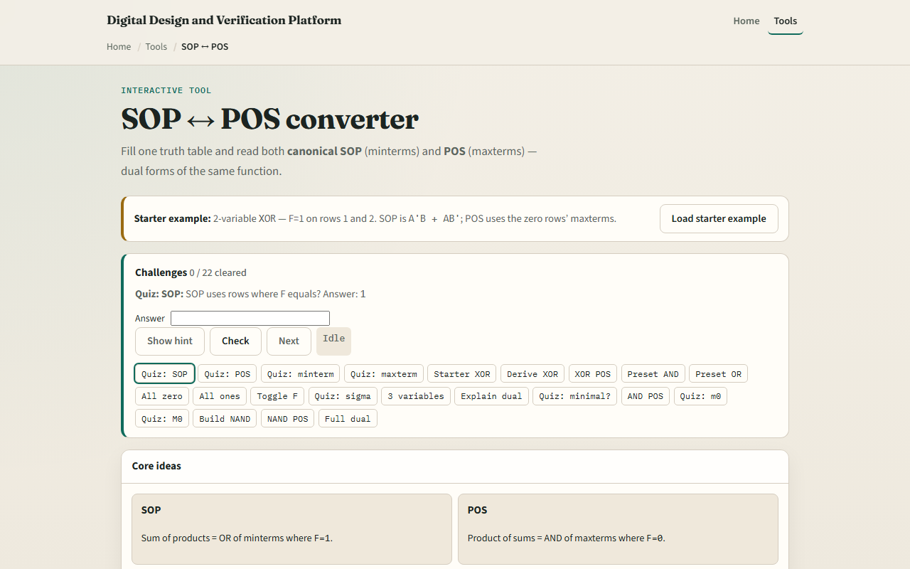

# SOP and POS

Sum-of-products ORs minterms where F is one

---

## Minterms and maxterms
- A minterm is a product true on exactly one row, like A-prime B for m zero on two variables
- A maxterm is a sum false on exactly one row, like A plus B for M zero
- Canonical SOP lists every one row; canonical POS lists every zero row
- That full form is not always minimal, you still simplify with grouping or laws

---

## Browser lab

---

## Workbook practice
- In the workbook track, take two-variable XOR
- Write canonical SOP from rows one and two, and POS from rows zero and three
- For AND, note only m three is one
- For all zeros, SOP is zero; for all ones, both forms collapse to one
- Name one pitfall: assuming canonical SOP is already minimal

---

## Pitfalls to watch
- Do not mix SOP and POS rules, SOP uses F equals one, POS uses F equals zero
- Minterm m zero and maxterm M zero are different shapes
- And remember: the browser lab is literacy
- Real synthesis picks the form that fits your gate library and timing

---

## Your turn
- Complete the checklist for at least one track, preferably both
- In the browser, finish a few challenges after the starter
- On paper, write SOP and POS for one small table
- When you are ready, take the short quiz, then continue to don’t-care minimization

