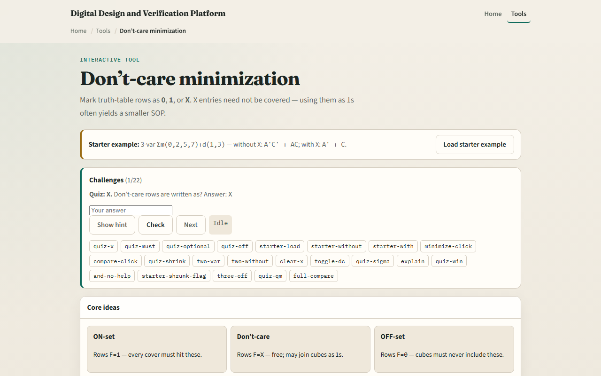

# Don’t-care minimization

Some input combinations never happen, or the output does not matter when they do

---

## ON, OFF, and optional
- Every product term must cover all ON minterms
- Cubes must never include an OFF row
- Don’t-care rows are optional, you choose zero or one to enlarge groups
- Sigma-m with d lists minterms and don’t-cares
- Compare covers side by side to see the shrink

---

## Browser lab

---

## Workbook practice
- In the workbook track, take the starter pattern by hand
- Write the ignore-X SOP, then regroup using X at one and three
- Confirm the with-X form has fewer terms
- Try a two-variable preset with one ON and one X
- Name one pitfall: treating X as OFF by default and missing a smaller cover

---

## Pitfalls to watch
- Do not let a group cover an OFF row
- X is not “don’t optimize”, it is “pick whichever helps.” And remember
- Real designs still need a spec for what is truly unreachable versus merely unused

---

## Your turn
- Complete the checklist for at least one track, preferably both
- In the browser, finish a few challenges after the starter
- On paper, minimize one small table with at least one X
- When you are ready, take the short quiz, then continue to logic hazards

