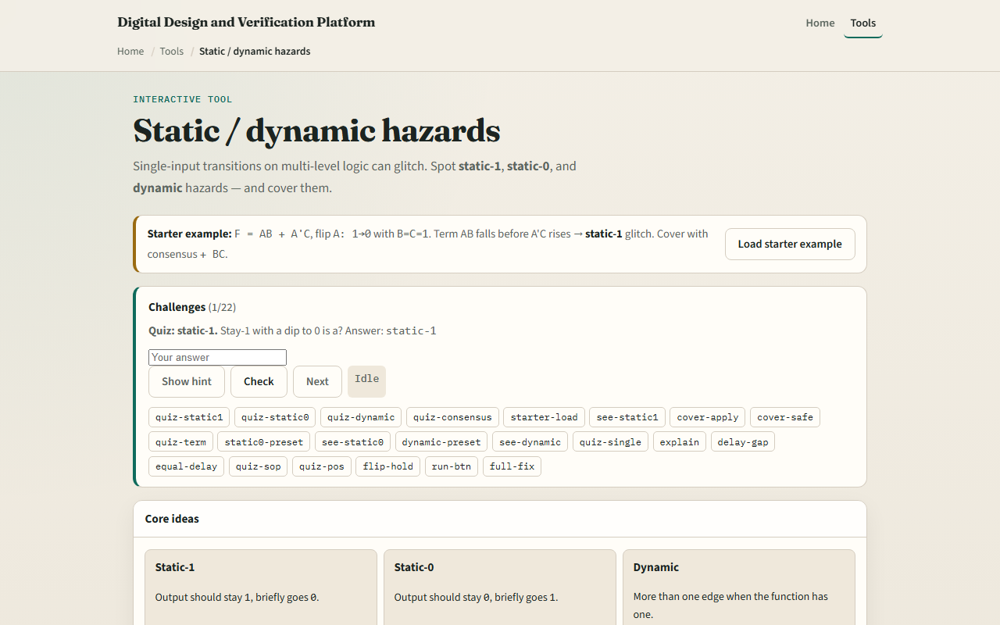

# Module 16 — Logic hazards

**Module id:** module16-logic-hazards  
**Lab:** logic-hazards  
**Tracks:** A (workbook) · B (browser lab)

## Slide 1 — Logic hazards

Combinational logic can glitch when inputs change. A static-one hazard dips to zero while the function should stay one. A static-zero hazard spikes high while output should stay zero. Dynamic hazards add extra transitions. This module makes run, see, and cover hazards concrete.

## Slide 2 — One input moves, paths differ

Hazard analysis usually changes one input at a time. Different path delays let one SOP term drop before another picks up—classic static-one on A B plus A-prime C when A falls with B and C held at one. A consensus term that bridges adjacent cubes—like B C here—can cover the gap. Equal delays can hide the glitch in simulation but not in silicon.

## Slide 3 — Browser lab

In the browser lab, look at three pieces: the challenge panel, the circuit and timing trace, and Run or Apply cover controls. Load the starter for A B plus A-prime C with A going one to zero and B equals C equals one. Run the transition and watch a static-one verdict. Apply consensus cover with B C and rerun for a safe steady one. Try static-zero and dynamic presets too. Use Check when a challenge looks done.

## Slide 4 — Workbook practice

In the workbook track, sketch why A B and A-prime C both cover ABC when A is one, but only B C holds when A is zero. Write the consensus term B C by hand. Name static-one versus static-zero from the dip or spike direction. Note one pitfall: assuming equal gate delays means no hazard in real hardware.

## Slide 5 — Pitfalls to watch

Do not confuse a hazard with wrong logic—the truth table can be correct while timing glitches. Cover terms must actually bridge the risky transition. And remember: the browser lab is literacy. Real designs still need timing analysis, registers, or hazard-free encodings where glitches matter.

## Slide 6 — Your turn

Complete the checklist for at least one track—preferably both. In the browser, finish a few challenges after the starter. On paper, identify one static hazard and one consensus fix. When you are ready, take the short quiz, then continue to gate composer.
