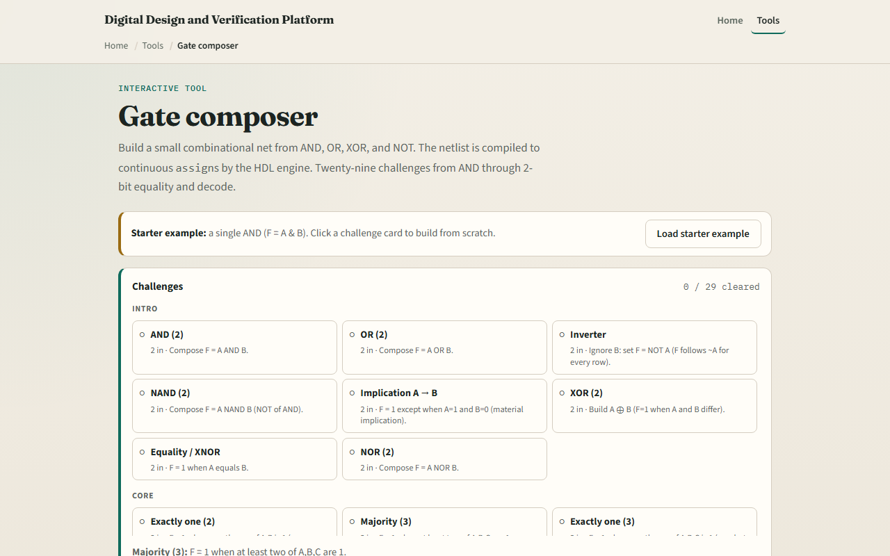

# Gate composer

Boolean functions become gate networks, AND, OR, NOT, and friends wired together

---

## Wire, probe, check
- Place gates, connect inputs A through D, and read output F on every row
- NAND is NOT of AND; XOR is one when inputs differ
- A two-to-one mux selects B or C under A
- Full-adder sum is A xor B xor Cin; carry-out is majority
- The truth table is the judge, if every row matches, the net is correct

---

## Browser lab

---

## Workbook practice
- In the workbook track, sketch a two-input XOR from AND, OR
- Draw a three-input majority gate net
- Write the half-adder sum and carry as gate names
- Name one pitfall: a net that works on three rows but fails on the fourth

---

## Pitfalls to watch
- Do not leave inputs floating, every gate input must be tied
- Reusing the wrong polarity breaks active-high logic
- And remember: the browser lab is literacy
- Real RTL still needs synthesis, timing, and test vectors beyond one truth table

---

## Your turn
- Complete the checklist for at least one track, preferably both
- In the browser, finish a few challenges after the starter
- On paper, draw one small gate net and label wires
- When you are ready, take the short quiz, then continue to mux and decoder

