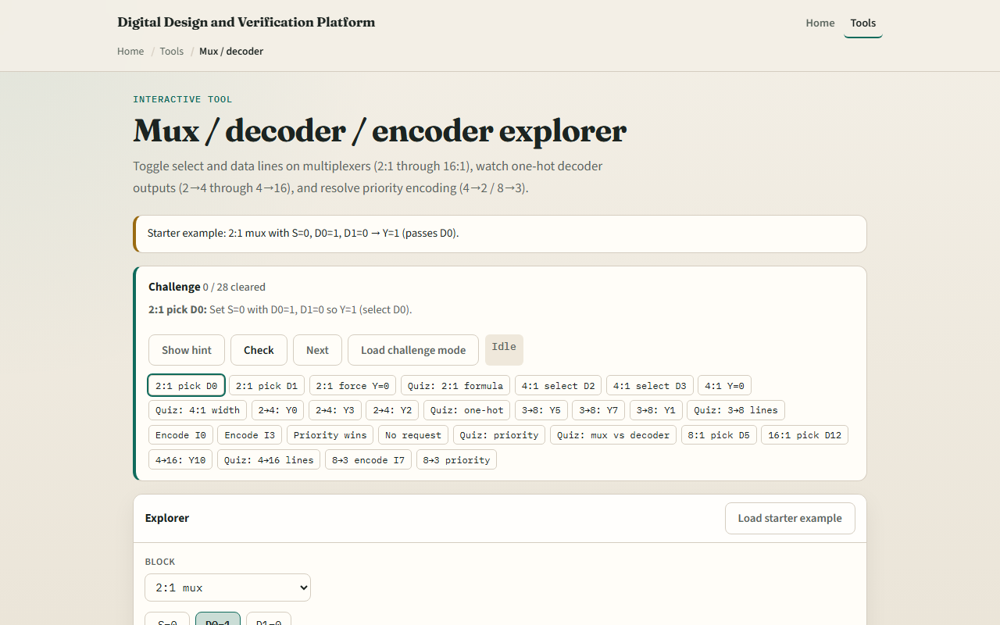

# Mux, decoder, encoder

A multiplexer picks one data input under select control, two inputs need one select bit, four inputs need two

---

## Select, one-hot, encode
- Two-to-one mux: Y equals D zero when S is zero, D one when S is one
- Four-to-one extends the select field
- A two-to-four decoder lights exactly one Y line for addr zero zero through one one
- Priority encoder
- All inputs zero means V equals zero

---

## Browser lab

---

## Workbook practice
- In the workbook track, write the two-to-one mux truth table by hand
- For addr one zero on a two-to-four decoder, say which Y line is high
- Encode only I three set and give Y and V
- Name one pitfall: confusing mux select width with decoder output count

---

## Pitfalls to watch
- Do not tie multiple decoder outputs high at once, that is not one-hot
- Encoder priority rules differ by design, know high versus low index first
- And remember: the browser lab is literacy
- Real buses still need enables, tri-states, and timing on select changes

---

## Your turn
- Complete the checklist for at least one track, preferably both
- In the browser, finish a few challenges after the starter
- On paper, sketch one mux and one decoder example
- When you are ready, take the short quiz, then continue to priority and compare

