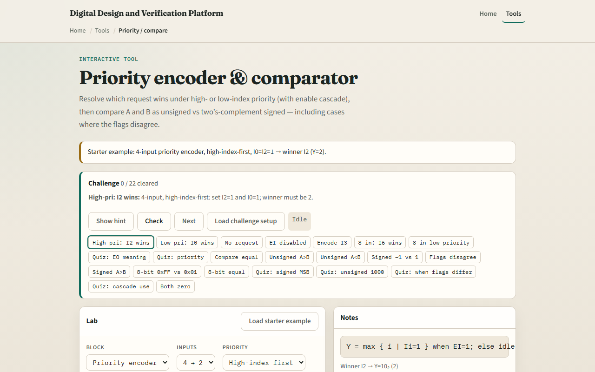

# Priority & compare

When several requests arrive at once, a priority encoder picks one winner and reports its index

---

## Winner, flags, cascade
- High-index-first: if I zero and I two are both set, the winner is two
- Low-index-first would pick zero instead, priority is a design choice
- With all inputs zero and enable-in high
- Compare four-bit A and B
- Same bits can yield A greater unsigned but A less signed

---

## Browser lab

---

## Workbook practice
- In the workbook track
- With enable-in high and no inputs active, state V and enable-out
- For four-bit A equals fifteen and B equals one, say unsigned and signed relational results
- Name one pitfall: assuming comparator flags match without checking signed mode

---

## Pitfalls to watch
- Do not mix up priority direction, high versus low index first changes the answer
- Enable-out is not “any input high”; it means no local winner while enable-in is on
- And remember: the browser lab is literacy
- Real buses still need timing, width agreement

---

## Your turn
- Complete the checklist for at least one track, preferably both
- In the browser, finish a few challenges after the starter
- On paper, sketch one priority case and one compare disagree case
- When you are ready, take the short quiz, then continue to half and full adder

