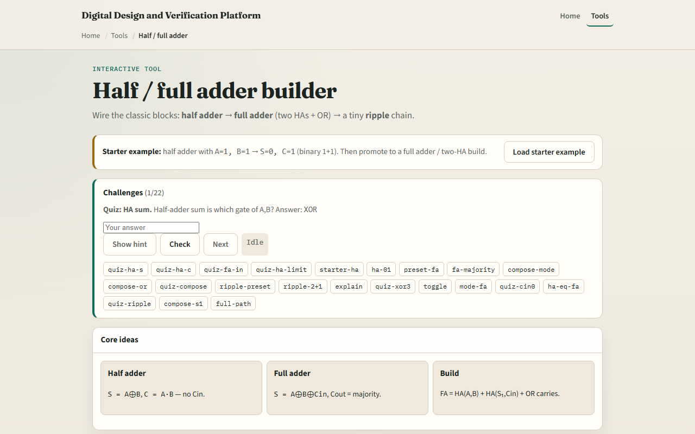

# Half / full adder

Addition starts with a half adder

---

## Sum, carry, chain
- Half adder truth
- Full adder with A, B, and Cin all one gives sum one and carry-out one, majority wins
- Compose view
- Ripple two bits

---

## Browser lab

---

## Workbook practice
- In the workbook track, fill the half-adder truth table for all four A-B pairs
- For full adder A equals one, B equals zero, Cin equals one, give S and Cout
- Sketch two half adders and an OR as one full adder
- For two-bit ripple with A equals one-zero and B equals one-one, name S zero, S one
- Name one pitfall: using a half adder where a column needs carry-in

---

## Pitfalls to watch
- Do not confuse half-adder carry with full-adder carry-out, they solve different problems
- Majority carry is not the same as HA carry alone when Cin is in play
- And remember: the browser lab is literacy
- Real adders still need timing, overflow flags

---

## Your turn
- Complete the checklist for at least one track, preferably both
- In the browser, finish a few challenges after the starter
- On paper, draw one HA truth table and one FA from two HAs
- When you are ready, take the short quiz, then continue to XOR parity tree

