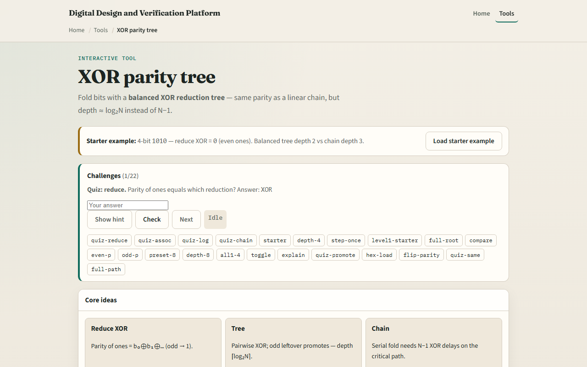

# XOR parity tree

Parity counts whether the number of ones is even or odd

---

## Fold, depth, even and odd
- Four-bit one-zero-one-zero has two ones, so reduce XOR equals zero
- Level one pairs one xor zero and one xor zero to get one-one
- Tree depth for four bits is two; chain depth is three
- Even parity bit equals reduce XOR; odd parity is the inverse
- Flip any single bit and parity toggles
- An odd leftover at a tree level promotes unchanged to the next row

---

## Browser lab

---

## Workbook practice
- In the workbook track, reduce-xor the bits one-one-zero-one by hand
- Draw a balanced tree for eight bits and state tree depth versus chain depth
- For reduce XOR equals one, give even and odd parity bits
- Name one pitfall: building a long XOR chain when a tree would meet timing

---

## Pitfalls to watch
- Do not confuse even parity with odd parity, one is the complement of the other
- Tree and chain must agree on the final bit, but not on delay
- And remember: the browser lab is literacy
- Real links still need generator polynomials, multi-bit ECC

---

## Your turn
- Complete the checklist for at least one track, preferably both
- In the browser, finish a few challenges after the starter
- On paper, sketch one four-bit tree and label each level
- When you are ready, take the short quiz, then continue to tri-state and bus

