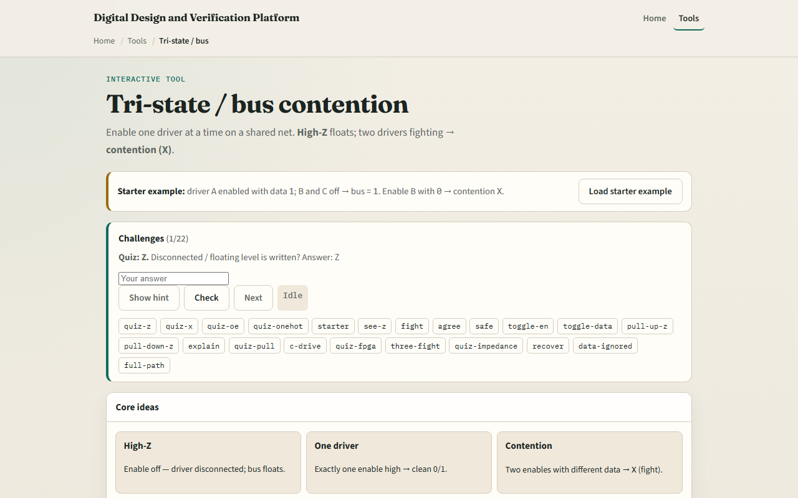

# Tri-state / bus

A shared bus lets several drivers connect to one wire, but only one should drive at a time

---

## Enable, float, fight
- Starter case: driver A enabled with data one, B and C off, the bus is one
- Turn all enables off with no pull and the bus is Z
- Enable B with zero while A still drives one and you get contention X
- Two drivers on the same value may still show that bit
- Safe protocol: exactly one enable high, often one-hot output-enable in real designs

---

## Browser lab

---

## Workbook practice
- In the workbook track, fill a small table
- Sketch three tri-state buffers on one bus line with enable pins
- With all enables low and pull-up on, what is the bus?
- Name one pitfall: enabling two drivers at once on an external bus

---

## Pitfalls to watch
- Do not treat multi-drive same value as safe, it still violates one-driver discipline
- Internal FPGA fabrics often prefer muxes over tri-state
- And remember: the browser lab is literacy
- Real boards still need OE timing, bus holders, and protocol rules beyond this toy resolver

---

## Your turn
- Complete the checklist for at least one track, preferably both
- In the browser, finish a few challenges after the starter
- On paper, draw one bus with two drivers and label Z and X cases
- When you are ready, take the short quiz, then continue to barrel shifter

