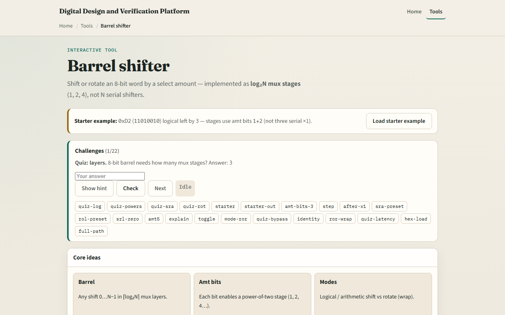

# Barrel shifter

A barrel shifter moves every bit in one operation, logical left, logical right, arithmetic right, or rotate

---

## Stages, modes, result
- Starter: hex D two is one-one-zero-one-zero-zero-one-zero
- Logical left by three enables amount bits one and two
- After stage one you get one-zero-one-zero-zero-one-zero-zero
- Logical right fills with zeros from the left
- Arithmetic right replicates the sign bit
- Rotate wraps bits with no fill loss

---

## Browser lab

---

## Workbook practice
- In the workbook track, SLL hex eight zero right by one and give the result
- For amount five, list which power-of-two stages fire
- Sketch three mux layers for an eight-bit barrel
- Contrast SRL and SRA on a negative pattern
- Name one pitfall: confusing barrel stages with counting single-bit shifts one at a time

---

## Pitfalls to watch
- Do not assume amount N means N serial one-bit layers
- SRA and SRL differ only in the fill bit
- And remember: the browser lab is literacy
- Real ALUs still need variable-width rules, flags

---

## Your turn
- Complete the checklist for at least one track, preferably both
- In the browser, finish a few challenges after the starter
- On paper, trace one starter stage by stage
- When you are ready, take the short quiz, then continue to seven segment

