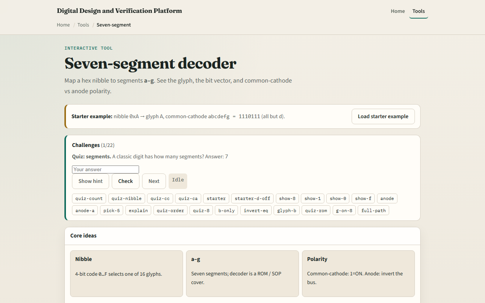

# Seven-segment

A seven-segment display turns a four-bit nibble into a glyph, zero through nine and A through F

---

## Segments, patterns, polarity
- Starter nibble A in common cathode drives one-one-one-zero-one-one-one
- Digit eight lights all seven; digit one lights only b and c on the right
- Digit zero turns g off in the middle
- Flip to common anode and the same glyph needs the bitwise complement on the drive bus
- The decoder is a lookup table, ROM or case statement in RTL, not seven unrelated wires

---

## Browser lab

---

## Workbook practice
- In the workbook track
- Write the common-cathode pattern for F
- For nibble A on common anode, give the inverted drive string
- Name one pitfall

---

## Pitfalls to watch
- Do not scramble segment order, this lab uses abcdefg as the bit string
- Mixed-case hex letters are for readability, not arbitrary encoding
- And remember: the browser lab is literacy
- Real displays still need current limiting, multiplexing

---

## Your turn
- Complete the checklist for at least one track, preferably both
- In the browser, finish a few challenges after the starter
- On paper, draw one digit and write its abcdefg pattern
- When you are ready, take the short quiz, then continue to clock edge stepper

