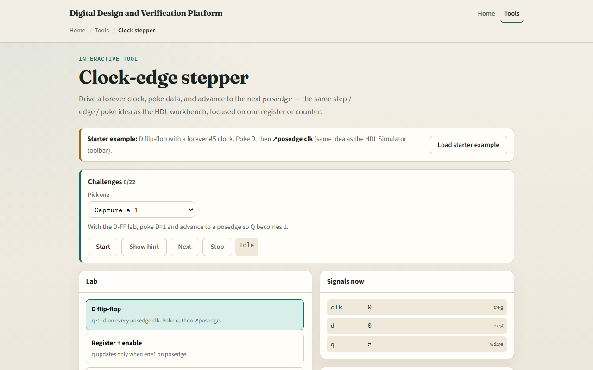

# Clock-edge stepper

Sequential logic does not change on every input wiggle, it samples on a clock edge

---

## Poke, edge, capture
- Starter lab: D flip-flop with a toggling clock
- Set D to one, apply poke, then advance to posedge clk, Q becomes one
- Set D to zero and take another posedge, Q returns to zero
- Enable registers only capture when EN is high
- Counters increment on edge after reset clears
- A pipeline needs two edges before the second stage sees your bit

---

## Browser lab

---

## Workbook practice
- In the workbook track, sketch a D flip-flop timing diagram
- For an enable register with EN equals zero, say whether Q changes on posedge
- Draw two pipeline stages and label the one-cycle delay
- Name one pitfall: changing D and expecting Q to move before the clock edge

---

## Pitfalls to watch
- Do not confuse level-sensitive latches with edge-triggered flops
- Reset and enable matter on the same edge as data
- And remember: the browser lab is literacy
- Real designs still need setup, hold

---

## Your turn
- Complete the checklist for at least one track, preferably both
- In the browser, finish a few challenges after the starter
- On paper, draw one posedge capture wave
- When you are ready, take the short quiz, then continue to setup and hold

