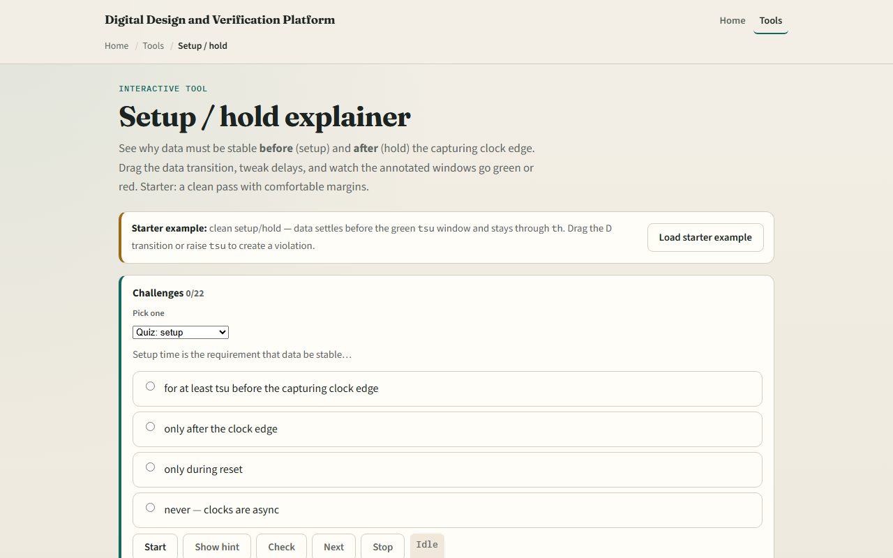

# Setup / hold

A flip-flop does not sample D at an instant, it needs setup time before the clock edge and hold time after

---

## Windows, margins, Q delay
- Starter case: clean pass with comfortable margins
- D settles at time fourteen
- Data stays low through the hold window after the edge
- Q moves at edge plus tcq
- Drag D later into the red setup band and setup fails
- Flip D too soon after the edge and hold fails

---

## Browser lab

---

## Workbook practice
- In the workbook track, draw one posedge with tsu and th bands on the D line
- For edge at twenty, tsu two, D change at nineteen, does setup pass?
- For hold th one, D change at twenty point five, does hold pass?
- Sketch a two-FF path and label tcq, tpd, and tsu
- Name one pitfall: changing D on the same cycle you expect Q to capture it

---

## Pitfalls to watch
- Do not confuse this teaching diagram with full static timing analysis or SPICE
- Setup and hold are flip-flop requirements, combo logic delay is separate
- And remember: the browser lab is literacy
- Real chips still need SDC constraints, corners

---

## Your turn
- Complete the checklist for at least one track, preferably both
- In the browser, finish a few challenges after the starter
- On paper, mark setup and hold on one wave
- When you are ready, take the short quiz, then continue to reset timelines

