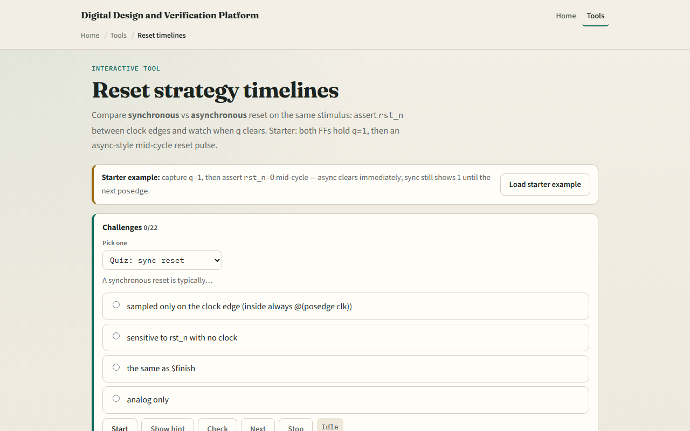

# Module 27 — Reset timelines

**Module id:** module27-reset-timelines  
**Lab:** reset-timelines  
**Tracks:** A (workbook) · B (browser lab)

## Slide 1 — Reset timelines

Reset puts a flip-flop into a known state—usually zero when rst_n is low. Synchronous reset samples rst_n only on the clock edge, inside always posedge clk. Asynchronous reset lists negedge rst_n in the sensitivity list and can clear q between edges. Active-low rst_n means zero asserts reset. This module compares both styles on one timeline.

## Slide 2 — Mid-cycle, edge, release

Starter scenario: drive D to one, take a posedge so both q_sync and q_async become one. Assert rst_n low mid-cycle—the async flop clears immediately; the sync flop still reads one until the next posedge. At a posedge with rst_n still low, both clear. Release rst_n high, then capture new data on a later edge. A short mid-cycle pulse may be ignored by sync reset if it ends before the sampling edge.

## Slide 3 — Browser lab

In the browser lab, look at three pieces: the challenge panel, the dual FF waveforms, and the poke and posedge controls. Load the starter—mid-cycle reset with async cleared and sync still high. Run scenario scripts or step actions side by side. Use Check when a challenge looks done.

## Slide 4 — Workbook practice

In the workbook track, sketch clk, rst_n, and q for sync versus async when reset falls between edges. Write the always block for each style. For rst_n low at posedge, do both FFs end at zero? Name one pitfall: releasing async reset too close to a clock edge without recovery time.

## Slide 5 — Pitfalls to watch

Do not assume sync and async behave the same off the edge—this lab shows the split on purpose. rst_n naming implies active low, not “never reset.” And remember: the browser lab is literacy. Real SoCs still need reset trees, CDC, and recovery or removal checks beyond this pair of toy FFs.

## Slide 6 — Your turn

Complete the checklist for at least one track—preferably both. In the browser, finish a few challenges after the starter. On paper, draw one mid-cycle reset wave. When you are ready, take the short quiz, then continue to clock enable versus gated clock.
