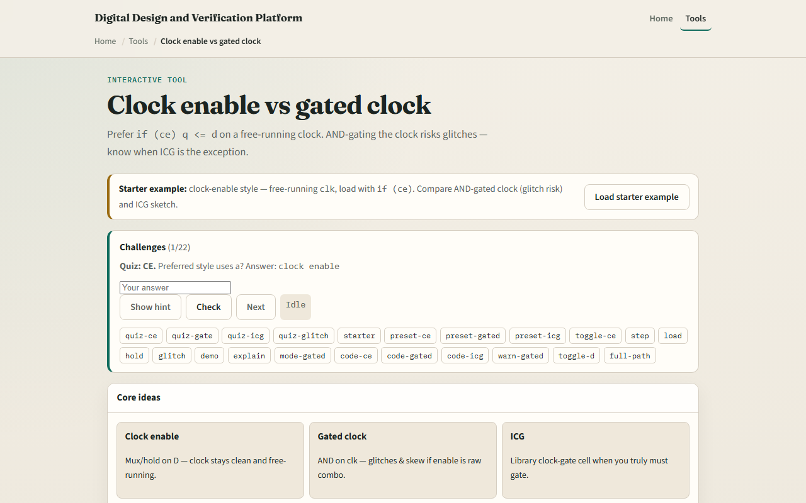

# Clock enable vs gated clock

To save power or skip cycles you can stop updating a register, but how you stop matters

---

## Load, hold, glitch
- Starter: clock-enable mode with ce equals one, each posedge loads d into q
- Set ce to zero and q holds even if d changes
- Switch to AND-gated mode and arm an enable glitch while clk is high, the warning lights up
- ICG sketch shows latched enable for cleaner gating
- Preferred RTL default: clock enable on the data path, not raw AND on clk

---

## Browser lab

---

## Workbook practice
- In the workbook track, write the always block for clock enable versus AND-gated clock
- Sketch clk, ce, and q for CE equals one then CE equals zero with d changing
- Explain why ce toggling during clk high is risky for gated mode
- Name one pitfall: using AND-gated clocks without an ICG cell in real silicon

---

## Pitfalls to watch
- Do not confuse holding q with stopping the clock, CE holds data; gating stops edges
- Glitches on gated clocks can cause extra captures or timing nightmares
- And remember: the browser lab is literacy
- Real designs still need clock-tree constraints, ICG rules, and STA on enable paths

---

## Your turn
- Complete the checklist for at least one track, preferably both
- In the browser, finish a few challenges after the starter
- On paper, draw one CE hold wave and one gated-glitch caution
- When you are ready, take the short quiz, then continue to CDC and two-FF sync

