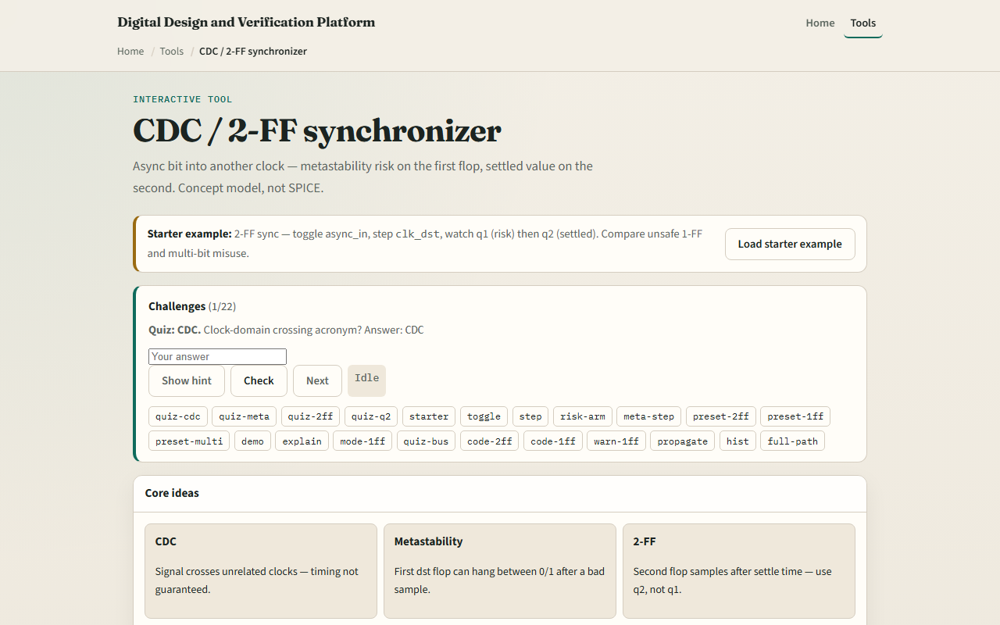

# CDC / 2-FF sync

When a signal crosses from one clock domain to another

---

## Safe, unsafe, multi-bit
- Starter: two-FF mode with async_in toggling and clk_dst stepping
- After a near-edge sample, q1 may show M for metastable
- One-FF mode is unsafe, sync_out comes straight from q1
- Multi-bit misuse warns you
- Never fan q1 into combinational logic in the dst domain

---

## Browser lab

---

## Workbook practice
- In the workbook track, draw async_in, q1, q2, and sync_out across two dst clock edges
- Write the always block for a two-FF synchronizer
- Explain why q2 is the safe output
- Sketch what goes wrong with one flop or with an eight-bit bus through two flops
- Name one pitfall: using q1 before it has settled

---

## Pitfalls to watch
- Do not treat CDC as a timing exception you can ignore
- Two flops improve MTBF but do not make multi-bit buses safe
- And remember: the browser lab is literacy
- Real designs still need CDC constraints, synchronizer cells

---

## Your turn
- Complete the checklist for at least one track, preferably both
- In the browser, finish a few challenges after the starter
- On paper, draw one two-FF settle wave and one multi-bit caution
- When you are ready, take the short quiz, then continue to the FSM designer lab

