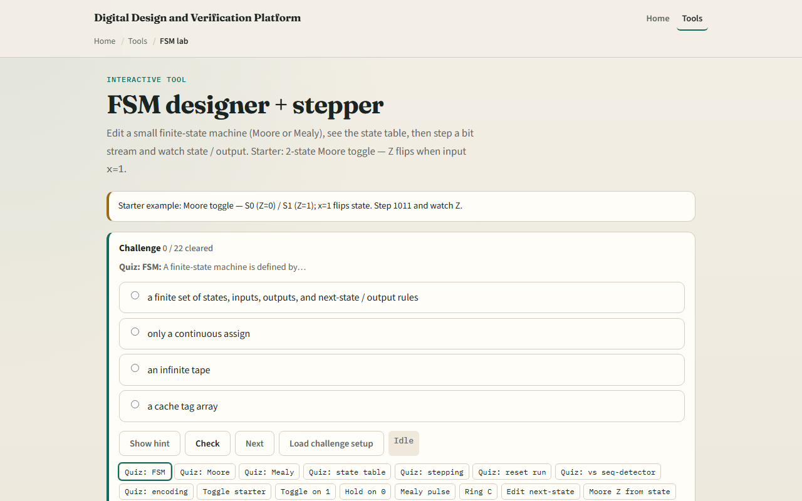

# Module 30 — FSM designer

**Module id:** module30-fsm-lab  
**Lab:** fsm-lab  
**Tracks:** A (workbook) · B (browser lab)

## Slide 1 — FSM designer

A finite-state machine has a finite set of states, inputs, outputs, and rules for what happens next. Given the present state and input x, the transition table says the next state—and maybe the output Z. Moore machines tie Z to the current state only. Mealy machines tie Z to the state and input together, on the arc. Controllers, sequencers, and protocol engines are all FSMs in disguise. This module lets you sketch, step, and read them in the browser.

## Slide 2 — Moore toggle starter

Starter: Moore toggle with two states—S0 outputs zero, S1 outputs one. When x equals one, the state flips; when x equals zero, it holds. Step the stream one-zero-one-one and watch Z follow the state: flip on each one, hold on each zero. The transition table lists next state for every state-and-input pair. Try the Mealy pulse preset too—Z pulses only on the transition when x equals one.

## Slide 3 — Browser lab

In the browser lab, look at three pieces: the state graph, the editable transition table, and the bit-stream stepper with Z history. Load the starter—Moore toggle on stream one-zero-one-one. Step one bit at a time, switch presets, or edit a blank three-state table. Use Check when a challenge looks done.

## Slide 4 — Workbook practice

In the workbook track, draw a two-state Moore toggle and fill in its transition table. Write one sentence on how Moore output differs from Mealy. Sketch a three-state ring that advances on x equals one. Name one pitfall: forgetting a default transition or leaving a state unreachable.

## Slide 5 — Pitfalls to watch

Do not mix Moore and Mealy rules in the same table—output columns mean different things. One input bit per step is like one clock cycle; the stream is not arbitrary analog time. And remember: the browser lab is literacy. Real RTL still needs encoding, reset state, and synthesis-friendly state registers.

## Slide 6 — Your turn

Complete the checklist for at least one track—preferably both. In the browser, finish a few challenges after the starter. On paper, draw one Moore table and one Mealy arc with Z on it. When you are ready, take the short quiz, then continue to state encoding.
