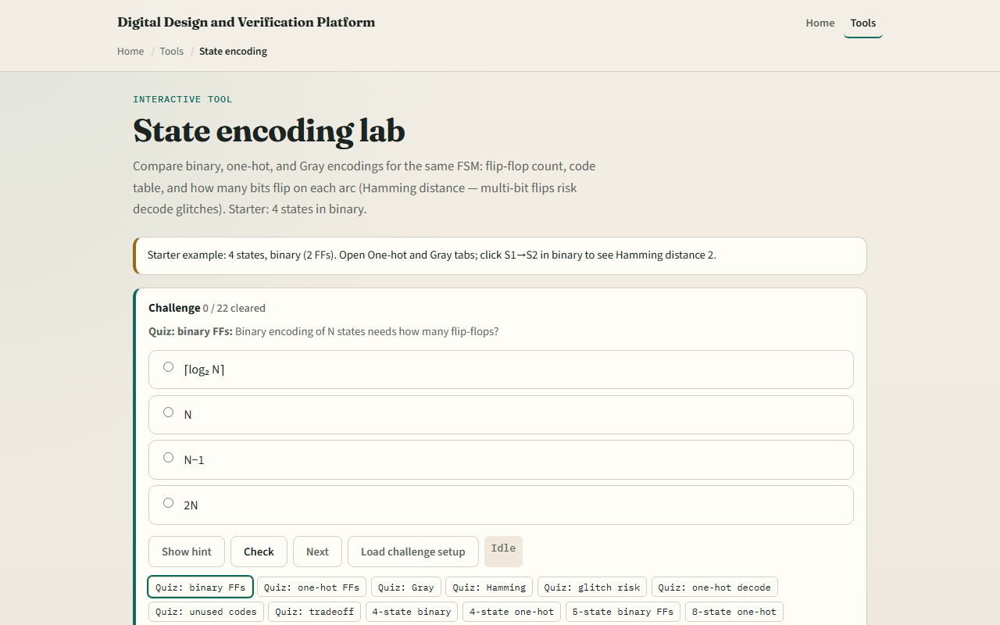

# Module 31 — State encoding

**Module id:** module31-state-encoding  
**Lab:** state-encoding  
**Tracks:** A (workbook) · B (browser lab)

## Slide 1 — State encoding

An FSM has abstract states S0, S1, S2—but silicon stores bit patterns in flip-flops. Binary encoding is compact: N states need ceiling log two N bits. One-hot uses N flip-flops with exactly one bit high—wider, but easy to decode. Gray codes assign indices so consecutive codes differ in exactly one bit—good for counters and ring steps. The choice trades area, speed, and glitch risk on transitions.

## Slide 2 — Hamming distance and flips

Starter: four states in binary—two flip-flops. Click S1 to S2 and Hamming distance is two—both bits flip. That matters because combinational decode can briefly see illegal intermediate codes. Switch to one-hot: four bits, one high; most arcs flip two bits but decode is a single wire. Switch to Gray: ring steps often have Hamming one. Yellow rows in the arc table flag multi-bit transitions.

## Slide 3 — Browser lab

In the browser lab, look at three pieces: the encoding tabs, the state code table, and the arc grid with Hamming distances. Load the starter—four states, binary. Compare one-hot and Gray, change state count, click an arc to see which bits flip. Use Check when a challenge looks done.

## Slide 4 — Workbook practice

In the workbook track, write binary codes for four states and mark Hamming distance on S0 to S1 versus S1 to S2. Sketch one-hot for three states. Explain why five states in three binary bits leaves unused codes—and what recovery rule you would add. Name one pitfall: multi-bit flips glitching state decode.

## Slide 5 — Pitfalls to watch

Do not assume binary is always best—compact codes can hazard decode. One-hot costs more FFs but simplifies “are we in S2?” checks. Unused binary codes need a default next-state, not hope. And remember: the browser lab is literacy. Real RTL still needs synthesis encoding hints and safe illegal-state recovery.

## Slide 6 — Your turn

Complete the checklist for at least one track—preferably both. In the browser, finish a few challenges after the starter. On paper, draw one binary multi-flip arc and one Gray single-flip step. When you are ready, take the short quiz, then continue to the sequence detector.
