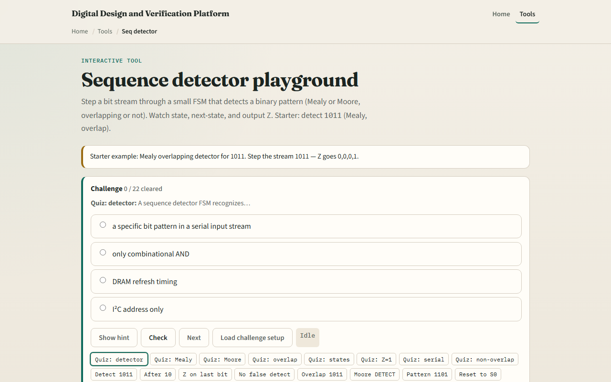

# Sequence detector

A sequence detector is an FSM that watches a serial bit stream and raises Z when a target pattern appears

---

## Detect 1011 starter
- Starter: Mealy overlapping detector for pattern one-zero-one-one
- Step stream one-zero-one-one, Z goes zero, zero, zero, one on the last bit
- States track matched prefix: empty, one, one-zero, one-zero-one
- Toggle overlap off and see restart behavior
- Switch to Moore and Z comes from the detect state instead of the arc
- Try pattern one-one-zero-one or a longer stream with two overlapping matches

---

## Browser lab

---

## Workbook practice
- In the workbook track
- Fill the transition table for S2 on inputs zero and one
- Explain what state you enter after a failed bit
- Sketch one overlapping case: one-zero-one-one-one should match twice
- Name one pitfall: forgetting overlap when the pattern repeats inside itself

---

## Pitfalls to watch
- Do not confuse Mealy pulse timing with Moore level timing, downstream logic may care
- Prefix recovery is not optional; brute-force reset wastes matches
- Non-overlap mode is a different spec, know which you need
- And remember: the browser lab is literacy
- Real RTL still needs correct encoding, reset state, and test streams

---

## Your turn
- Complete the checklist for at least one track, preferably both
- In the browser, finish a few challenges after the starter
- On paper, draw one Mealy detect arc and one overlap restart
- When you are ready, take the short quiz, then continue to ring and Johnson counters

