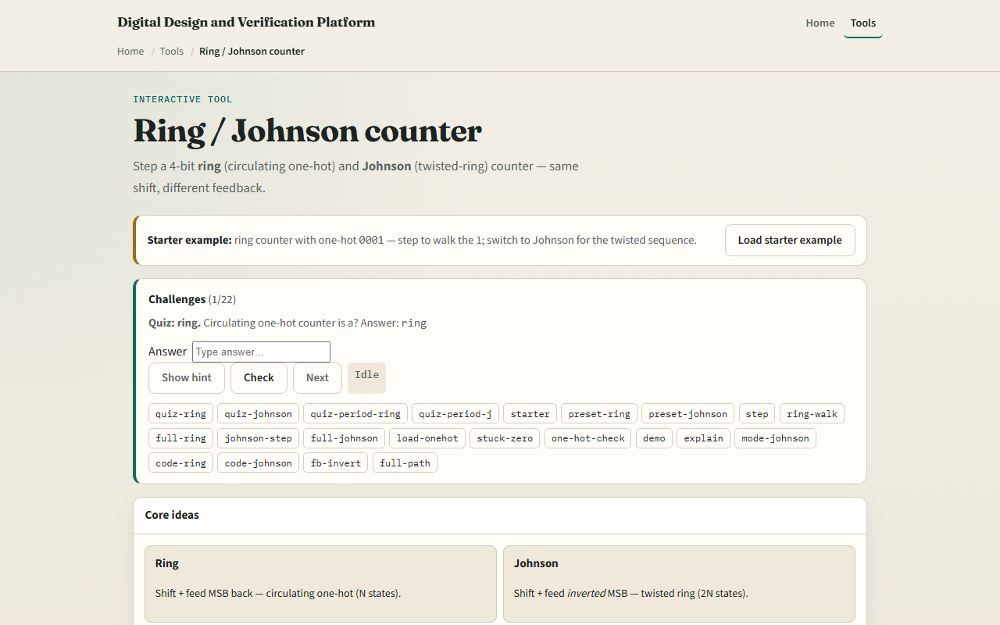

# Ring / Johnson

A shift register with feedback becomes a counter without a binary adder

---

## Ring walk starter
- Starter: ring mode with one-hot pattern zero-zero-zero-one
- Step once and the one moves to zero-zero-one-zero
- Four steps complete a full ring period back to zero-zero-zero-one
- Switch to Johnson: load zero-zero-zero-zero, step eight times for the full two-N cycle
- Watch the feedback box, plain q-three for ring, not-q-three for Johnson
- Beware all-zero on a ring, it can lock with zero feedback forever

---

## Browser lab

---

## Workbook practice
- In the workbook track, write the always block for ring versus Johnson feedback
- List four ring states starting from zero-zero-zero-one
- Count Johnson states for four bits, why two-N?
- Sketch what happens if a ring starts at all-zero
- Name one pitfall: invalid init or illegal states without recovery

---

## Pitfalls to watch
- Do not confuse display order, here q-three through q-zero is MSB left
- Ring needs valid one-hot init; Johnson needs the right reset
- Neither replaces a binary counter when you need full two-to-the-N counting
- And remember: the browser lab is literacy
- Real designs still need timing, enable, and illegal-state handling

---

## Your turn
- Complete the checklist for at least one track, preferably both
- In the browser, finish a few challenges after the starter
- On paper, draw one ring walk and one Johnson feedback inversion
- When you are ready, take the short quiz, then continue to LFSR and PRBS

