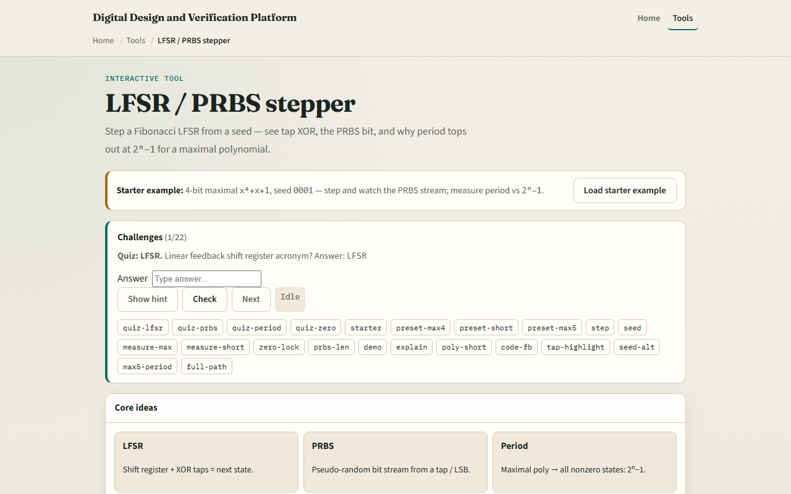

# LFSR / PRBS

A linear feedback shift register is a shift chain with XOR taps feeding the next MSB

---

## Maximal starter
- Starter: four-bit maximal polynomial x-four plus x plus one, seed zero-zero-zero-one
- Step and watch feedback XOR the taps, the register shift, and PRBS bits accumulate
- Measure period, you should see fifteen before the seed returns
- Try the short polynomial x-four plus x-squared plus one for contrast, period under fifteen
- Load all-zero and see the lock warning: feedback stays zero forever
- Never seed all-zero on a real LFSR

---

## Browser lab

---

## Workbook practice
- In the workbook track
- Compute period for n equals four with a maximal poly
- Sketch why all-zero is forbidden
- Explain one use case: PRBS for a serial link or BIST pattern
- Name one pitfall: non-maximal polynomial or bad seed choice

---

## Pitfalls to watch
- Do not confuse PRBS with true random, it repeats after the period
- Maximal taps matter; a wrong polynomial shortens the cycle
- All-zero locks the register
- And remember: the browser lab is literacy
- Real designs still need tap polynomials from tables, seed logic

---

## Your turn
- Complete the checklist for at least one track, preferably both
- In the browser, finish a few challenges after the starter
- On paper, draw one LFSR step with XOR feedback
- When you are ready, take the short quiz, then continue to the ripple-carry adder animator

