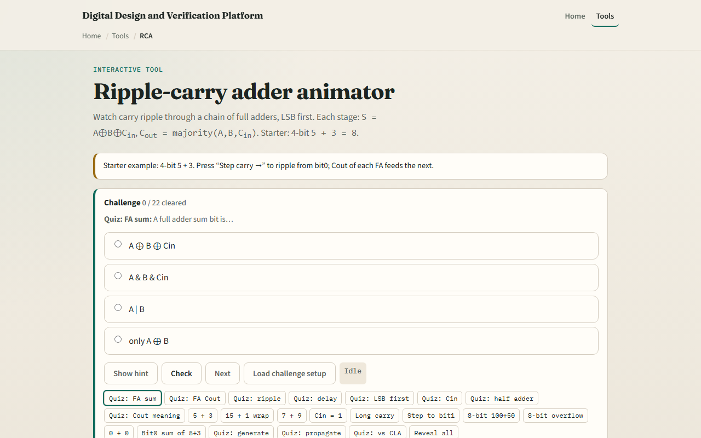

# Ripple-carry adder

Adding multi-bit numbers means chaining full adders: each stage takes A, B, and carry in, and produces sum and carry out

---

## Five plus three starter
- Starter: four-bit A equals five, B equals three, Cin zero
- Step carry from bit zero: LSBs are both one, so S0 is zero and Cout is one into bit one
- Keep stepping until all four stages reveal, sum eight, Cout zero
- Try fifteen plus one to see unsigned wrap: sum zero, Cout one
- The delay note reminds you: critical path is about N full-adder carry delays
- Wide adders use lookahead instead

---

## Browser lab

---

## Workbook practice
- In the workbook track, draw one full adder with sum and Cout equations
- Ripple four bits for five plus three by hand
- Explain why bit one waits on bit zero’s Cout
- Sketch fifteen plus one in four bits
- Name one pitfall: treating Cout as signed overflow instead of unsigned wrap

---

## Pitfalls to watch
- Do not assume ripple is fast at sixty-four bits, carry must walk the chain
- Half adders have no Cin; full adders do
- Cin equals one is common for two’s-complement subtract
- And remember: the browser lab is literacy
- Real RTL still needs timing analysis and often carry-lookahead or prefix adders

---

## Your turn
- Complete the checklist for at least one track, preferably both
- In the browser, finish a few challenges after the starter
- On paper, draw one ripple step with Cout feeding the next Cin
- When you are ready

