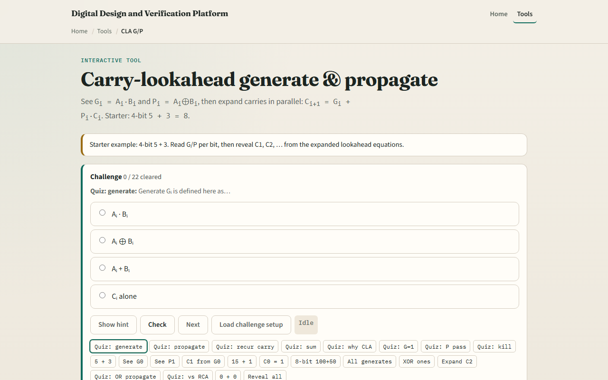

# Carry-lookahead G/P

Ripple-carry waits for each Cout before the next Cin

---

## Five plus three starter
- Starter: four-bit A equals five, B equals three, C zero zero
- Bit zero: both inputs one
- Step to reveal C one, C two
- Full reveal: sum eight, Cout zero
- If G is one, carry out is one regardless of Cin
- If G is zero and P is one, carry passes

---

## Browser lab

---

## Workbook practice
- In the workbook track, write G, P, and C one for bit zero of five plus three
- Expand C two symbolically from G one, P one, G zero, and C zero
- Explain generate versus propagate in one sentence each
- Sketch why CLA trades area for speed versus ripple
- Name one pitfall: confusing G with P or forgetting sum uses P XOR C

---

## Pitfalls to watch
- Do not treat expanded equations as magic, each term is a real AND-OR path
- G equals one always wins; P equals zero kills carry regardless of Cin
- Wide adders use prefix trees, not one giant flat expansion
- And remember: the browser lab is literacy
- Real RTL still needs sensible grouping and timing on carry paths

---

## Your turn
- Complete the checklist for at least one track, preferably both
- In the browser, finish a few challenges after the starter
- On paper, write one recursive C equation and one expanded C two
- When you are ready, take the short quiz, then continue to the array multiplier

