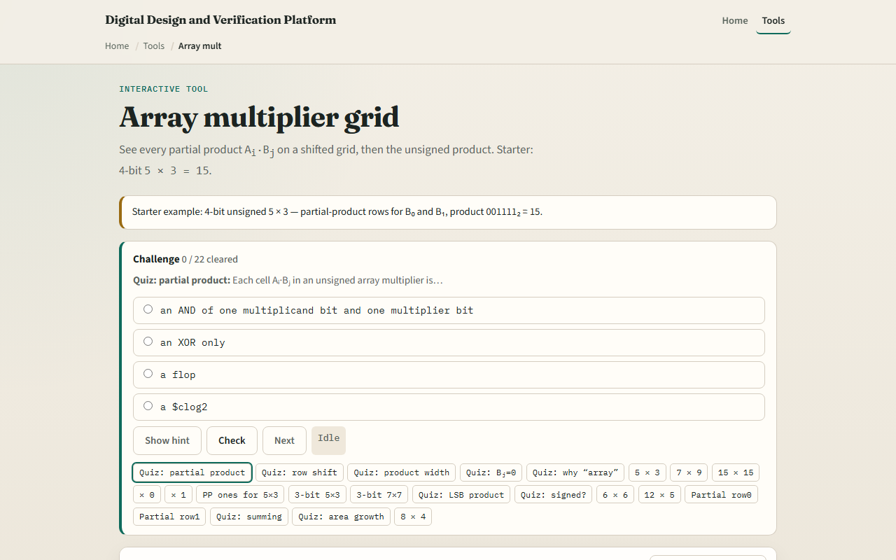

# Module 37 — Array multiplier

**Module id:** module37-array-mult  
**Lab:** array-mult  
**Tracks:** A (workbook) · B (browser lab)

## Slide 1 — Array multiplier

Unsigned multiply builds partial products from every bit pair. Cell A-i dot B-j is an AND—one if both bits are one. Row for B-j sits shifted left by j bit positions, matching pencil-and-paper multiply. Sum the shifted rows with adders and carries to get the product. An N-bit by N-bit result needs up to two-N bits. The array layout is regular but grows as N squared in AND area. This module shows the grid for four-bit five times three.

## Slide 2 — Five times three starter

Starter: four-bit unsigned A equals five, B equals three. Five is zero-one-zero-one, three is zero-zero-one-one. Partial row for B-zero is five; row for B-one shifted left is ten. Four AND cells are one in the grid. Add the partials and the product is fifteen—binary zero-zero-one-one-one-one. Product bit zero is A-zero AND B-zero only. If B-j is zero, that entire row is zeros.

## Slide 3 — Browser lab

In the browser lab, look at three pieces: the A and B bit rows, the partial-product grid, and the decimal product strip. Load the starter—four-bit five times three. Toggle bits, change width, read partial integers PP0 plus PP1. Use Check when a challenge looks done.

## Slide 4 — Workbook practice

In the workbook track, draw the AND grid for three-bit two times three. Write partial row zero and row one with shifts. Compute product bit zero by hand. Explain why N-bit times N-bit needs two-N bits. Name one pitfall: forgetting the left shift on each B-j row.

## Slide 5 — Pitfalls to watch

Do not confuse the AND grid with the final sum—adders still reduce the rows. Signed multiply needs Booth or similar, not this unsigned array alone. Area and delay scale with width; real chips use Wallace trees or Booth. And remember: the browser lab is literacy. Real RTL still needs pipelining and signed/unsigned rules.

## Slide 6 — Your turn

Complete the checklist for at least one track—preferably both. In the browser, finish a few challenges after the starter. On paper, sketch one partial row and one shifted row. When you are ready, take the short quiz, then continue to the ALU explorer.
