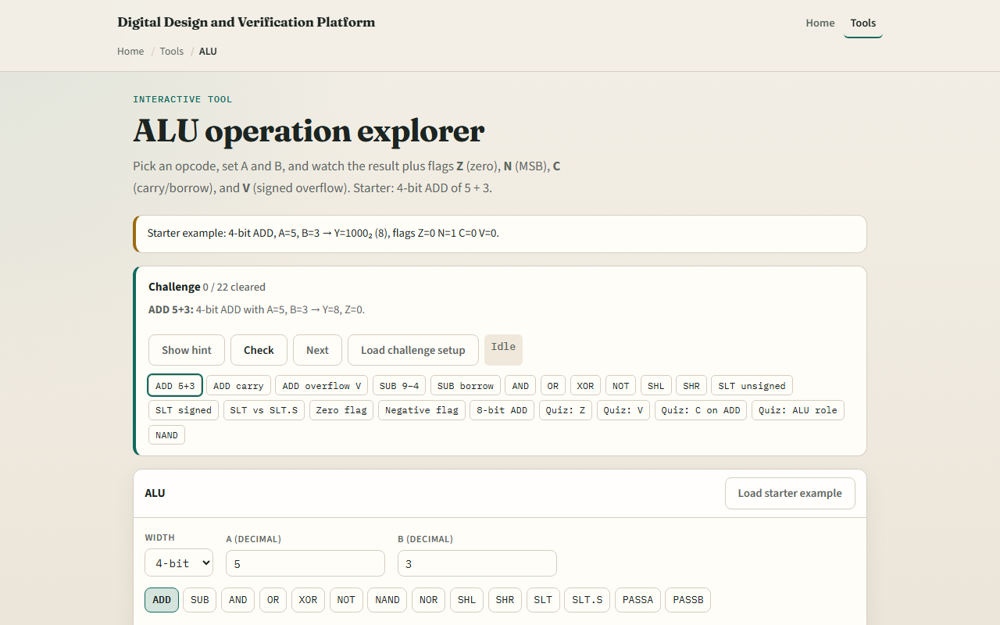

# ALU explorer

An arithmetic logic unit takes two operands, an opcode, and produces a result plus condition flags

---

## ADD five plus three starter
- Starter: four-bit ADD, A equals five, B equals three
- Result Y is one-zero-zero-zero binary
- Flags: Z zero, N one, C zero, V zero
- Switch opcode to SUB, AND, or SLT and watch Y and flags change
- On ADD, C equals one means unsigned carry out
- On SUB, C equals one means no borrow

---

## Browser lab

---

## Workbook practice
- In the workbook track, compute four-bit ADD five plus three and list Z, N, C, V
- Do SUB three minus five and explain C equals zero
- AND twelve with three for zero and Z equals one
- Explain when unsigned SLT and signed SLT.S disagree on fifteen versus one
- Name one pitfall: reading C as signed overflow instead of V

---

## Pitfalls to watch
- Do not mix unsigned carry with signed overflow, C and V mean different things
- N is MSB of result, not a separate sign register
- Compare ops return zero or one in Y, not a full difference
- And remember: the browser lab is literacy
- Real ALUs still need decode, timing, and ISA-specific flag rules

---

## Your turn
- Complete the checklist for at least one track, preferably both
- In the browser, finish a few challenges after the starter
- On paper, fill one opcode row with Y and flags
- When you are ready, take the short quiz, then continue to carry-select adder

