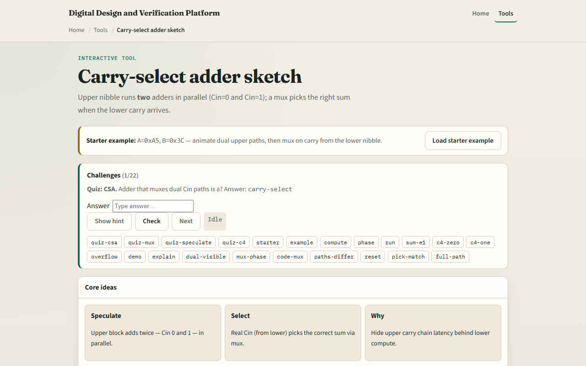

# Carry-select sketch

Ripple carry waits for each stage before the next begins

---

## A5 plus 3C starter
- Starter: eight-bit add, A equals hex A5, B equals hex three C
- Lower nibble: five plus C gives sum one and C4 equals one
- Upper dual paths: Cin zero gives D, Cin one gives E
- Mux selects the Cin-one path because C4 is one
- Final sum is hex E1, Cout zero
- Step through phases

---

## Browser lab

---

## Workbook practice
- On paper, sketch an eight-bit carry-select built from two four-bit blocks
- For A5 plus three C, compute lower sum and C4, both upper speculative sums
- Tabulate Cin zero versus Cin one paths
- Name the trade-off

---

## Pitfalls to watch
- Do not confuse speculation with the final answer, the mux must wait for real C4
- Both upper paths are computed in parallel; only one is selected
- C4 is carry out of the lower nibble, not the full eight-bit Cout
- And remember

---

## Your turn
- Complete the checklist for at least one track, preferably both
- In the browser, run all phases on the starter and confirm sum E1
- On paper, draw the dual upper paths and mux
- When you are ready, take the short quiz, then continue to Booth encode

