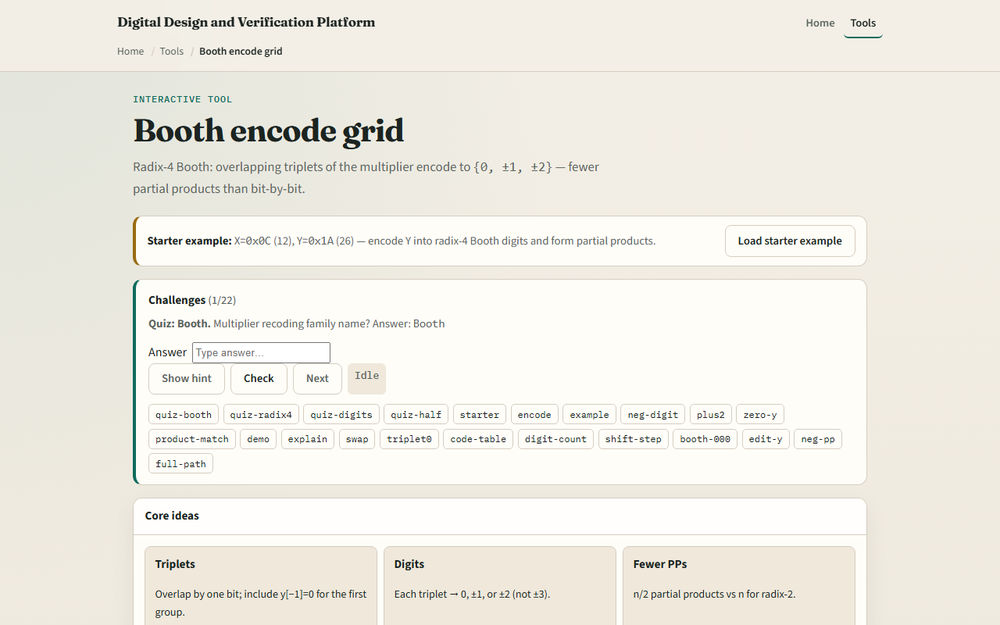

# Booth encode

Radix-four Booth recodes the multiplier Y into signed digits zero, plus or minus one, or plus or minus two

---

## 0C times 1A starter
- Starter: X equals hex zero C, twelve signed; Y equals hex one A, twenty-six
- Encode Y into four Booth digits: minus two, minus one, plus two, zero
- Digit zero triplet one-zero-zero uses y minus one equals zero
- Partial products: minus twenty-four, minus forty-eight, plus three eighty-four, zero
- Booth sum and signed X times Y both equal three twelve
- Click Encode Y to see the bit grid, digit cards, and partial-product list

---

## Browser lab

---

## Workbook practice
- On paper, encode Y equals one A into four radix-four Booth digits using the cheat table
- For triplet zero-one-one, record digit plus two
- Compute partial products for X equals twelve and sum them
- Draw how triplets overlap, each group shares one bit with the next
- Name one pitfall: forgetting y minus one on the first digit

---

## Pitfalls to watch
- Do not treat Booth digits as plain binary, they are signed recoding
- Triplet bits are y two i plus one, y two i, y two i minus one, not independent pairs
- Partial products with minus one or minus two need signed X
- And remember

---

## Your turn
- Complete the checklist for at least one track, preferably both
- In the browser, encode the starter and confirm product three twelve
- On paper, fill one row of the Booth table from a triplet you choose
- When you are ready, take the short quiz, then continue to signed arithmetic

