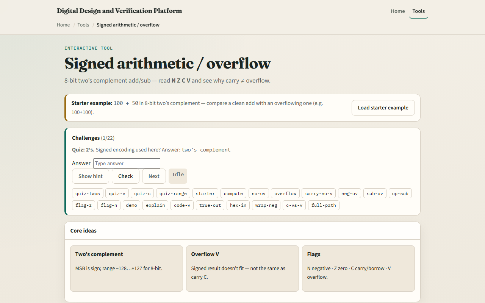

# Signed arithmetic

Eight-bit two's complement treats the MSB as sign: range minus one twenty-eight through plus one twenty-seven

---

## One hundred plus fifty starter
- Starter: add one hundred plus fifty in eight-bit two's complement
- Wrapped byte is hex nine six; signed view is minus one oh six
- Status panel shows true signed sum one fifty outside the eight-bit range
- Flags include V equals one when same-sign operands produce a result with flipped sign bit
- Compare with Example V equals one at one hundred plus one hundred
- And Example C equals one V equals zero at two hundred plus one hundred

---

## Browser lab

---

## Workbook practice
- On paper, add plus one hundred plus plus fifty and list wrapped hex, signed view, and V
- Do one hundred plus one hundred and record minus fifty-six with V equals one
- Do two hundred plus one hundred and note C equals one with V equals zero
- Write the V rule for add: same sign in, different sign out
- Name one pitfall: treating C as signed overflow

---

## Pitfalls to watch
- Do not read wrapped bits as the true signed answer when V equals one
- Subtract overflow uses a different V test than add, both mean out of range
- Negative numbers use two's complement, not sign-magnitude in this lab
- And remember

---

## Your turn
- Complete the checklist for at least one track, preferably both
- In the browser, run the starter and both overflow demos
- On paper, fill one row with operands, wrapped result, true signed, and NZCV
- When you are ready, take the short quiz, then continue to RAM and ROM map

