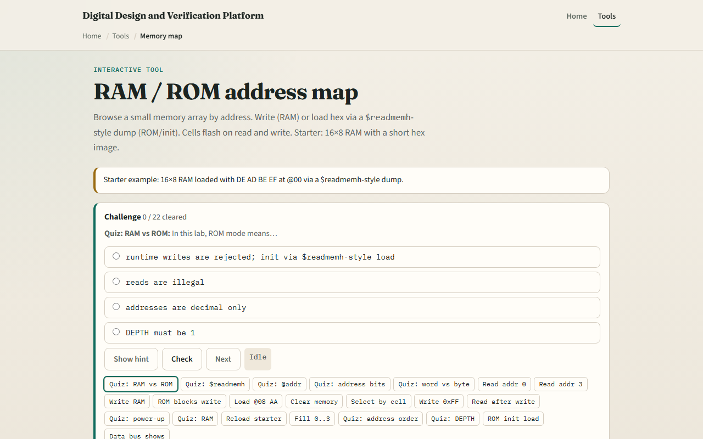

# Module 42 — RAM / ROM map

**Module id:** module42-mem-map  
**Lab:** mem-map  
**Tracks:** A (workbook) · B (browser lab)

## Slide 1 — RAM / ROM map

Memory maps connect an address bus to stored words. RAM allows read and write at runtime—contents change under software or testbench control. ROM holds a fixed image: reads work, but runtime writes are blocked. In simulation, both often initialize from a hex dump using dollar-readmemh syntax. Address at-sign sets the next load location; hex bytes fill sequential addresses. Here you have sixteen eight-bit words—four address bits.

## Slide 2 — DE AD BE EF starter

Starter: sixteen-by-eight RAM loaded from a readmemh-style dump. At address zero: hex DE, then AD, BE, EF. Read address zero gives data DE. Read address three gives EF. The grid shows every cell with at-sign and hex value. Switch to ROM and try a write—the status reports blocked. RAM mode lets you write fifty-five to address five and read it back. Load a dump with at-sign zero eight AA to place AA at mem eight.

## Slide 3 — Browser lab

In the browser lab, pick RAM or ROM mode. Set address and data, then Read or Write. The memory grid highlights the active cell—click a cell to select its address. Edit the hex dump and Load readmemh to reinitialize. The bus bar shows mode, address, data, and mem of addr. Try Read addr zero and Write in RAM versus ROM.

## Slide 4 — Workbook practice

On paper, draw a sixteen-word memory map with addresses zero through F. Label starter bytes DE AD BE EF at zero through three. Explain what at-sign zero A means in a readmemh file. Tabulate RAM versus ROM: read allowed, write allowed, init method. Name one pitfall: confusing byte address order with big-endian multi-byte layout elsewhere.

## Slide 5 — Pitfalls to watch

Do not assume ROM never changes—init load still programs the image in this lab. At-sign sets address; following bytes fill upward sequentially. Address bits are log two of depth—sixteen words need four bits, not eight. And remember: this explorer is one word wide; real systems add byte enables and wider buses.

## Slide 6 — Your turn

Complete the checklist for at least one track—preferably both. In the browser, read addr zero and three, then try a ROM-blocked write. On paper, sketch one readmemh dump with at-sign and four data bytes. When you are ready, take the short quiz, then continue to FIFO pointers.
