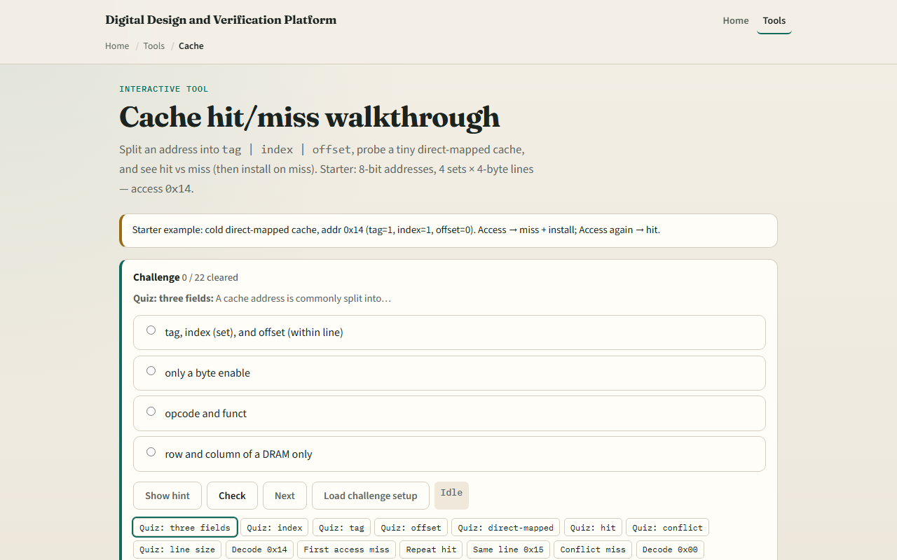

# Cache walk

A direct-mapped cache splits each address into tag, index, and offset

---

## Address 0x14 starter
- Starter: cold direct-mapped cache
- Address hex fourteen decodes to tag one, index one, offset zero
- First Access is a miss; install loads the line into set one
- Access again is a hit
- Address hex fifteen shares tag and index with offset one, still a hit, spatial locality
- Address hex twenty-four shares index one but tag two, a conflict miss

---

## Browser lab

---

## Workbook practice
- On paper, split address hex fourteen with two index and two offset bits
- Label tag, index, and offset values
- Draw four sets with one line each
- Trace cold access, install, repeat hit, and one conflict miss
- Compute line size as two to the offset bits and capacity as sets times line size
- Name one pitfall: assuming same index means same tag

---

## Pitfalls to watch
- Do not treat index as the full address, tag distinguishes lines in the same set
- Valid zero always means miss
- Direct-mapped is simple but thrashes on conflicts
- And remember

---

## Your turn
- Complete the checklist for at least one track, preferably both
- In the browser, decode zero fourteen, miss once, hit twice, then try zero twenty-four
- On paper, fill one row of the set table after install
- When you are ready, take the short quiz, then continue to dual-port RAM

