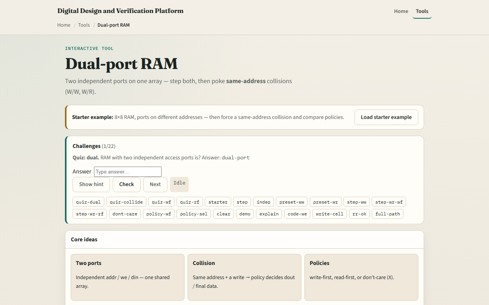

# Dual-port RAM

Dual-port RAM gives two independent access ports, address, write enable, and data in, sharing one memory array

---

## Independent ports starter
- Starter: eight-by-eight RAM with write-first policy
- Port A at address zero, port B at address one, no collision
- Step clock to read both ports independently
- Then preset W slash W collision
- Or preset W slash R: port A writes while port B reads
- Under write-first, B sees new data

---

## Browser lab

---

## Workbook practice
- On paper, draw an eight-word RAM with two ports
- Trace independent reads at addr zero and three
- Tabulate collision cases: W slash W, W slash R, R slash R same address
- For W slash R with write-first, note whether the read port sees old or new data
- Name one pitfall: assuming all BRAMs behave the same on collision

---

## Pitfalls to watch
- Do not ignore same-address writes
- Read-first versus write-first changes W slash R behavior on the read port
- R slash R at the same address is fine, both see the same cell
- And remember

---

## Your turn
- Complete the checklist for at least one track, preferably both
- In the browser, step independent ports, then collide with two policies
- On paper, sketch one W slash R timing with read-first
- When you are ready, take the short quiz, then continue to byte-enable memory

