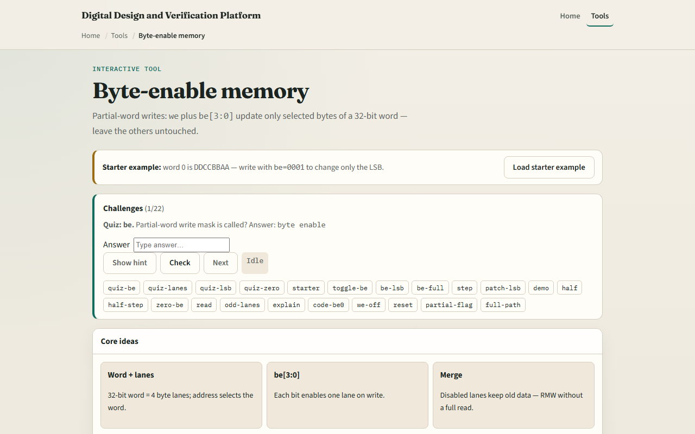

# Module 46 — Byte-enable memory

**Module id:** module46-byte-enable-mem  
**Lab:** byte-enable-mem  
**Tracks:** A (workbook) · B (browser lab)

## Slide 1 — Byte-enable memory

A thirty-two-bit word RAM can update one byte at a time using byte-enable bits. Address selects the word; be zero through three each gate one lane on write. Disabled lanes keep their old data—partial store without a full read-modify-write on the bus. Little-endian layout: be zero is byte zero, the LSB. CPU byte, halfword, and word stores map to different be patterns. We equals one with be all zero updates nothing.

## Slide 2 — be equals 0001 starter

Starter: four words by thirty-two bits. Word zero is hex DDCCBBAA—bytes AA, BB, CC, DD little-endian. Set addr zero, we equals one, be equals zero-zero-zero-one, din hex eight-eight-seven-seven-six-six-five-five. Step clock: only byte zero changes from AA to fifty-five. Word zero becomes DDCCBB55; BB, CC, DD unchanged. Try be equals one-one-one-one for a full word, or zero-zero-one-one for a low halfword.

## Slide 3 — Browser lab

In the browser lab, set addr, we, din, and toggle be three down to zero. Green highlights enabled lanes on the selected word. Step clk applies the masked write. Sample dout reads mem of addr without writing. Buttons set common patterns: LSB only, full word, halfword low, or be all zero.

## Slide 4 — Workbook practice

On paper, draw word zero with four byte lanes. Mark be equals zero-zero-zero-one and din byte zero equals fifty-five. Show the word before and after partial write. Tabulate be patterns: zero-zero-zero-one byte, zero-zero-one-one halfword, one-one-one-one word, zero-zero-zero-zero no change. Name one pitfall: confusing be bit order with big-endian byte numbering.

## Slide 5 — Pitfalls to watch

Do not assume we equals one always writes the full word—check be. Disabled lanes are not zeroed; they retain old values. Little-endian means be zero is the least significant byte. And remember: real systems also need alignment rules and write strobes; this lab is lane-mask literacy.

## Slide 6 — Your turn

Complete the checklist for at least one track—preferably both. In the browser, run the starter step and confirm only byte zero patches. On paper, sketch one partial write with be equals zero-zero-one-one. When you are ready, take the short quiz, then continue to async FIFO Gray pointers.
