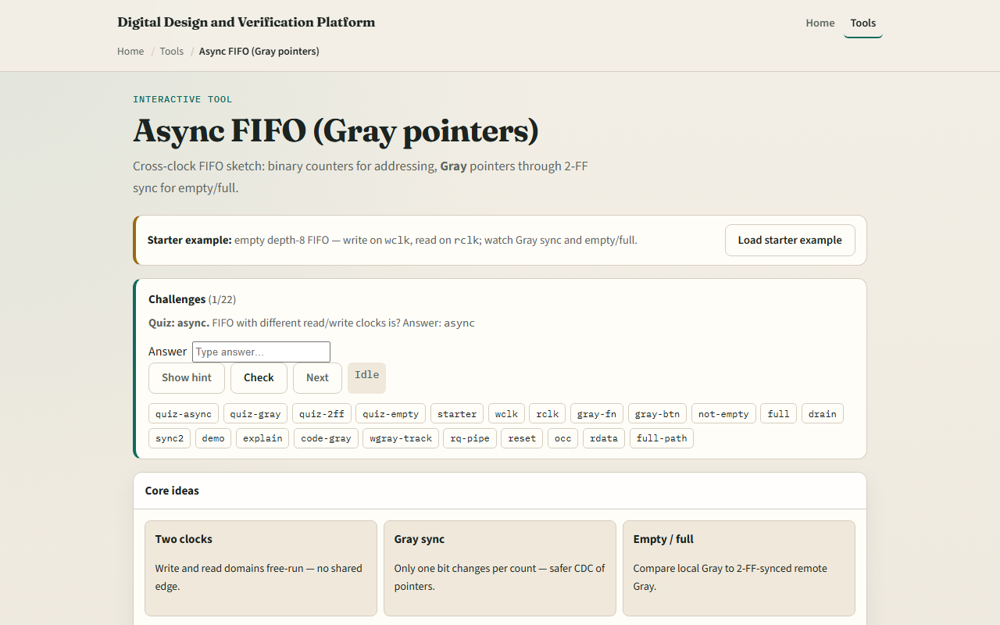

# Async FIFO (Gray)

A synchronous FIFO shares one clock

---

## Empty starter
- Starter: depth-eight FIFO, empty equals one, full equals zero
- Write domain has wbin and wgray; read domain has rbin and rgray
- Step wclk to write wdata hex A5 if not full, wbin advances, wgray updates
- Remote rgray syncs through rq1 and rq2 into the write domain for full detection
- Step rclk on the read side, wq1 and wq2 sync wgray for empty
- After writes and sync settle, empty clears and a read returns the oldest byte

---

## Browser lab

---

## Workbook practice
- On paper, compute Gray for binary zero through three
- Draw write and read domains with two-FF synchronizers crossing between them
- Explain why binary pointers are unsafe for CDC
- Write the empty condition in words
- Trace one write on wclk and when the read side can safely see not-empty

---

## Pitfalls to watch
- Do not compare unsynchronized binary pointers across clocks
- Empty and full can lag a few cycles after the other domain moves, that is intentional
- Gray is required because multi-bit binary can glitch during CDC
- And remember

---

## Your turn
- Complete the checklist for at least one track, preferably both
- In the browser, write once, sync, read once, then fill and drain
- On paper, list Gray codes for four binary values
- When you are ready, take the short quiz, then continue to handshake valid-ready

