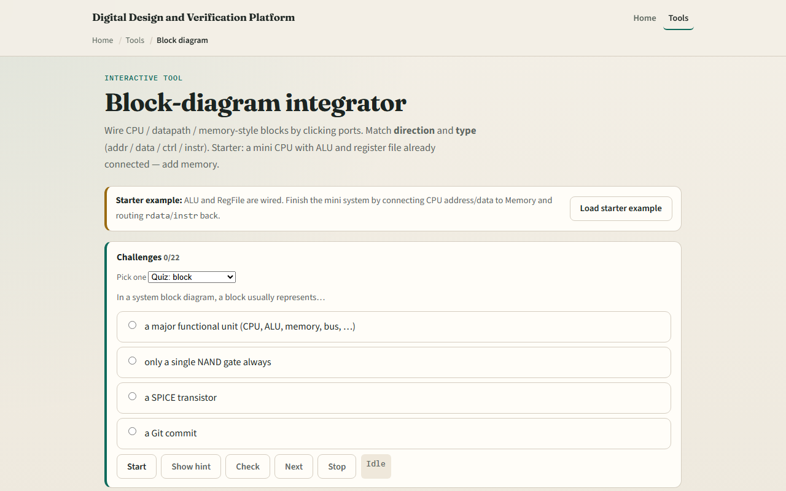

# Module 49 — Block-diagram integrator

**Module id:** module49-block-diagram  
**Lab:** block-diagram  
**Tracks:** A (workbook) · B (browser lab)

## Slide 1 — System integration

A chip is more than gates—it is blocks wired together. Each block is a major unit: CPU, ALU, register file, memory, or bus. Ports are named pins with direction and type—address, data, control, or instruction. A legal wire goes from an output to an input of the same type. The datapath is where computation happens: register file feeds the ALU, and results write back. Memory holds instructions and data. The CPU issues control, address, and data toward the rest of the system.

## Slide 2 — Starter mini CPU

Starter preset: CPU, ALU, RegFile, and Memory on the canvas. The datapath is already wired—rs1 and rs2 feed ALU inputs A and B, cpu alu_op drives the ALU operation, ALU result Y writes to rf rd, and cpu rf_ctrl enables the register write. Four links are still missing: CPU address to memory address, CPU write data to memory write data, memory read data back to the CPU, and memory instruction fetch to the CPU. Click an output port, then a matching input, until validation turns green.

## Slide 3 — Browser lab

In the browser lab, load the starter example and read the verdict panel. Green means all required wires are present with no illegal connections. Red marks type or direction mistakes. The connection list shows every wire; remove one to see validation fail. Try the complete preset to see a finished system, or the via-system-bus preset where the CPU talks to memory through a bus block. Challenges ask you to finish the starter or build from a blank canvas.

## Slide 4 — Workbook practice

On paper, sketch four blocks—CPU, ALU, RegFile, and Memory—and label their ports. Draw the five datapath wires from the starter. Add the four CPU-to-memory links and name each signal. Explain why addr cannot wire to a data port in this teaching model. Optionally sketch how a bus sits between CPU and memory instead of a direct link.

## Slide 5 — Pitfalls to watch

Do not wire output to output or input to input—direction matters. Types must match; the lab rejects addr-to-data mistakes. One input accepts only one driver; a new wire replaces the old one. This is a conceptual integration sketch, not a full SoC generator or place-and-route tool. And remember: missing even one required edge keeps the system incomplete even if everything else looks fine.

## Slide 6 — Your turn

Complete the checklist for at least one track—preferably both. In the browser, finish the starter until integration passes, then load the bus preset. On paper, list the nine required edges for the complete mini system. When you are ready, take the short quiz, then continue to the course wrap and Verilog bridge.
