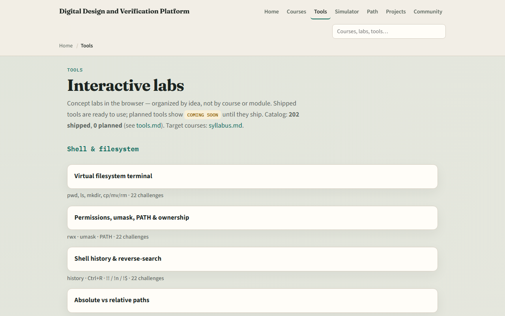

# Module 50 — Digital complete → Verilog

**Module id:** module50-wrap  
**Lab:** none (wrap)  
**Tracks:** recap · next course

## Slide 1 — Digital path complete

You have walked the digital foundations path—from radix and two’s complement, through Boolean logic and gates, into clocks, resets, and state machines, then datapath, memory, FIFOs, and handshakes. This short wrap names what you can do now and points you to the next course: learn Verilog.

## Slide 2 — What you can do now

You can move across number systems and encodings with confidence. You can reason about combinational and sequential logic, FSM encodings, and simple timing sketches. You can explain adders, ALUs, memory maps, Gray FIFO pointers, and valid-ready handshakes at the concept level—and wire blocks in a system diagram. You are not writing synthesizable HDL yet; you are building the mental model Verilog will describe.

## Slide 3 — Close the track gaps

If you mainly used browser labs, redo a few workbook sketches for the clock, reset, and FSM modules so tables and timing feel natural on paper. If you mainly used the workbook, open any skipped browser labs for interactive challenges. Either track works for self-study; both together stick best before you open a Verilog editor.

## Slide 4 — The labs you practiced

Here is the tools index again—the same shelf of concept labs you opened along the way. You do not need to re-clear every challenge. Use it as a map: if a skill still feels shaky, jump back to that lab, then return here when you are ready for RTL.

## Slide 5 — Next: learn Verilog

Verilog is where these concepts become modules, ports, and always blocks. Start learn Verilog from the syllabus when your wrap checklist feels honest. Keep a small practice folder for exercises—you will reuse it when simulating and debugging. The older combined digital-and-Verilog path is optional stretch reading, not required.

## Slide 6 — Your turn

Review the wrap checklist. Confirm you can explain radix, two’s complement, and a simple FSM encoding without looking it up. Name one module you would revisit if a topic still feels thin. When you are ready, take the short quiz, then continue to learn Verilog.
